# Atlas de Explicabilidade SHAP: Modelos de Predição de AMPs

**Data:** 29/12/2025  
**Modelos:** Random Forest (RF), Gradient Boosting (GB), Support Vector Machine (SVM)  
**Versão:** Final (com Interactions e Decision Plots)

---

## Introdução

Este documento serve como um **Atlas Visual** detalhado da "mente" dos nossos modelos de Inteligência Artificial. Utilizando o método SHAP (SHapley Additive exPlanations), apresentamos uma dissecação completa de como cada algoritmo processa as características físico-químicas para identificar Peptídeos Antimicrobianos.

---

## 1. Random Forest (RF) - O Modelo "Eletrostático Balanceado"

O Random Forest demonstrou ser um modelo robusto que equilibra bem as características de carga com propriedades estruturais.

### 1.1 Summary Plot (Visão Global)
*O gráfico mais importante. Resume a importância e o impacto direcional de todas as features.*

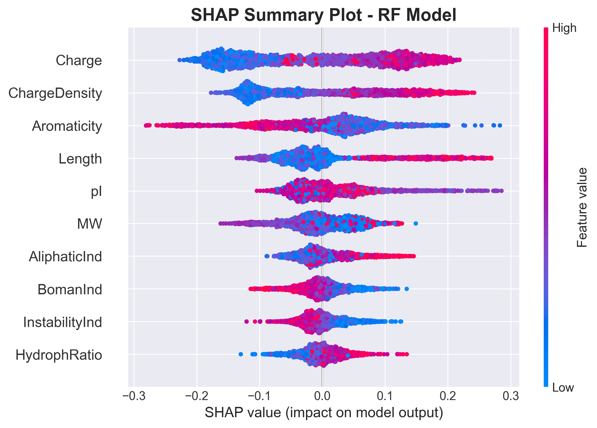

**Interpretação:**
*   **Charge (Carga):** É a feature nº 1. Note que os pontos vermelhos (valor alto de carga) estão concentrados no lado positivo do eixo X (embora o SHAP calcule para a classe positiva, a visualização confirma que carga extrema é determinante).
*   **ChargeDensity:** Segue o padrão da carga.
*   **Cauda Longa:** Note como features como `HydrophRatio` têm pouco impacto na maioria das amostras (concentradas em zero), mas ocasionalmente podem ser decisivas.

### 1.2 Bar Plot (Ranking Absoluto)
*Mostra a magnitude média do impacto, sem considerar a direção (+/-).*

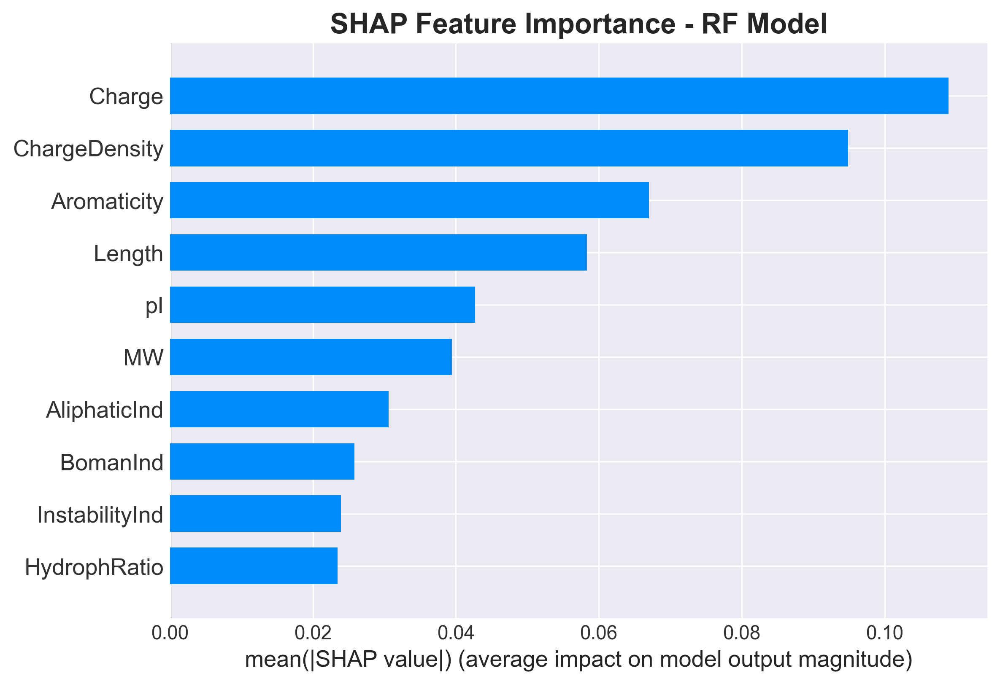

**Análise:** Confirma que a **eletrostática (Charge + ChargeDensity)** é responsável por cerca de 30-40% do poder de decisão do modelo, com `Aromaticity` e `Length` vindo em segundo plano.

### 1.3 Interações de Features (Novidade!)
*Como duas features trabalham juntas (Sinergia).*

**Carga vs Densidade de Carga:**
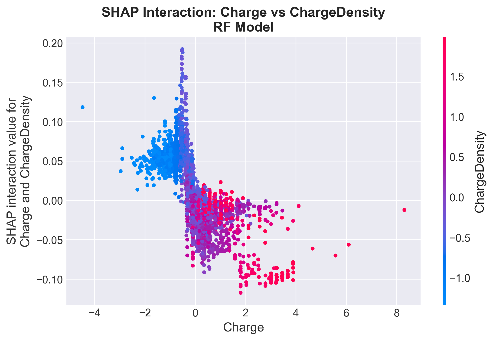
> O modelo entende que Carga e Densidade são acopladas. A "linha" vertical sugere que para uma mesma densidade, aumentar a carga total tem um efeito marginal decrescente.

**Comprimento vs Aromaticidade:**
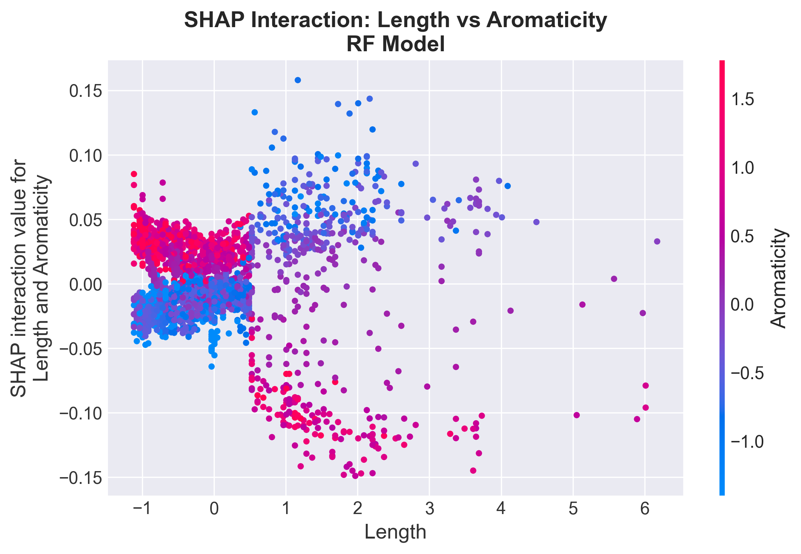
> **Crucial:** Esta interação mostra que a importância de resíduos aromáticos (âncoras de membrana) varia com o tamanho do peptídeo. Peptídeos de tamanhos específicos dependem mais de anéis aromáticos para serem classificados como AMPs.

### 1.4 Decision Plot (Trajetória de Decisão)
*O caminho percorrido desde a incerteza até a predição final.*

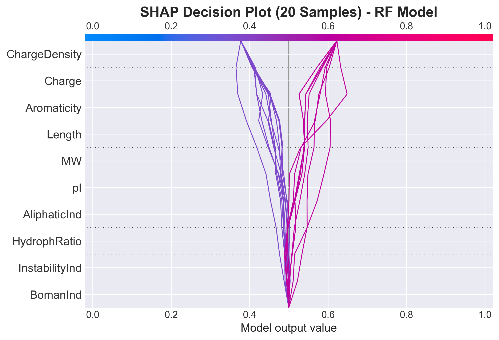

**Análise:**
*   As linhas convergem claramente para dois grupos: AMPs (topo) e Não-AMPs (fundo).
*   Observe como a feature `Charge` (geralmente no topo do eixo Y) costuma dar o "empurrão final" para a classificação.

### 1.5 Waterfall Plot (Exemplo de Predição Individual)
*Anatomia de uma única decisão (Amostra 1).*

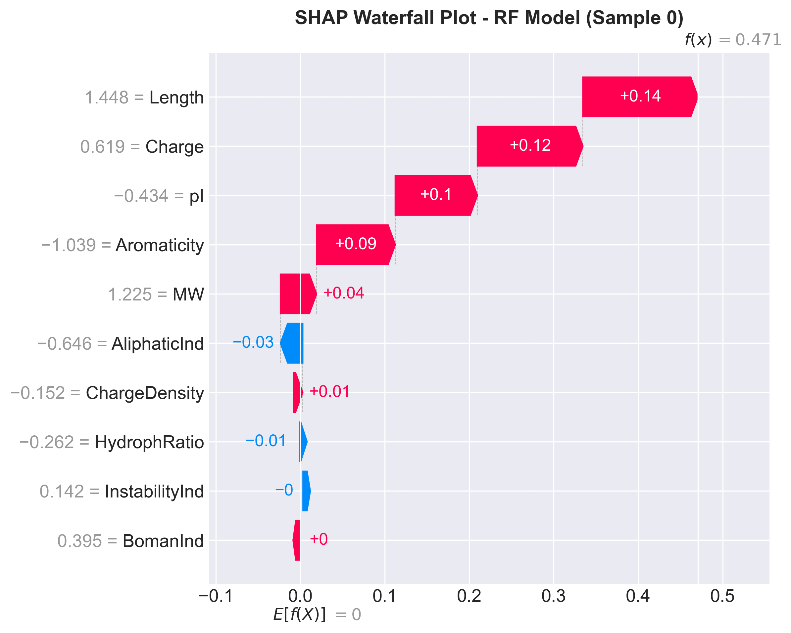

---

## 2. Gradient Boosting (GB) - O Modelo "Eletrostático Agressivo"

O GB foca intensamente na correção de erros, resultando em um modelo extremamente opinativo sobre Carga.

### 2.1 Summary Plot

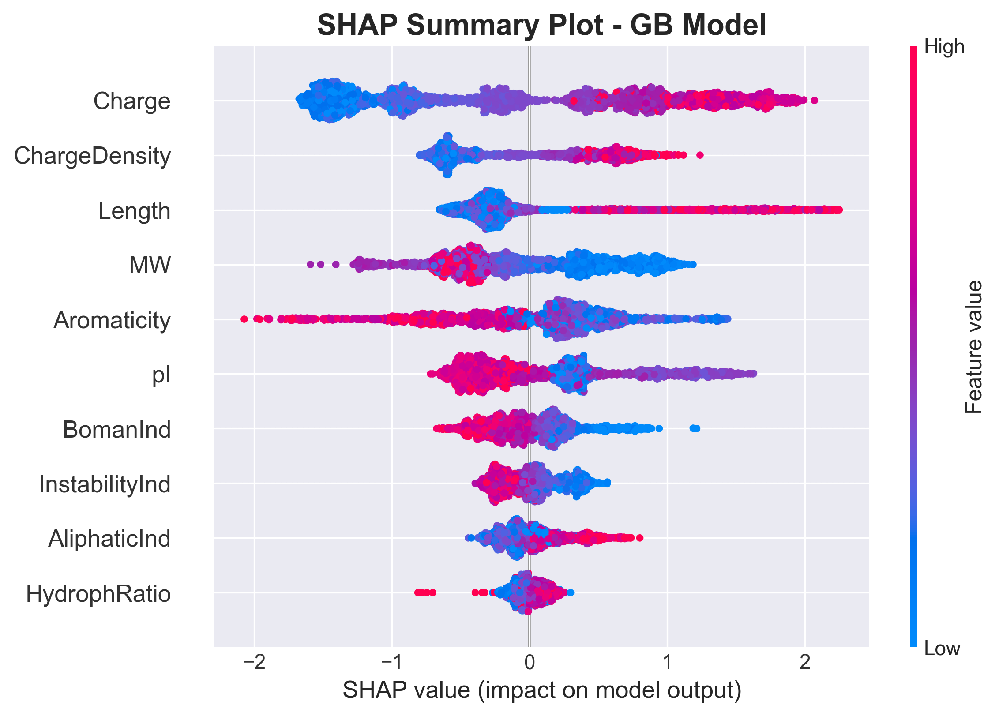

**Interpretação:**
*   **Dominância Absoluta:** Veja como os pontos de `Charge` se espalham muito mais no eixo X do que qualquer outra feature. O GB está dizendo: *"Se não tiver a carga certa, dificilmente será um AMP"*.
*   **Separação Clara:** A distinção entre pontos vermelhos e azuis para Carga é quase perfeita.

### 2.2 Bar Plot

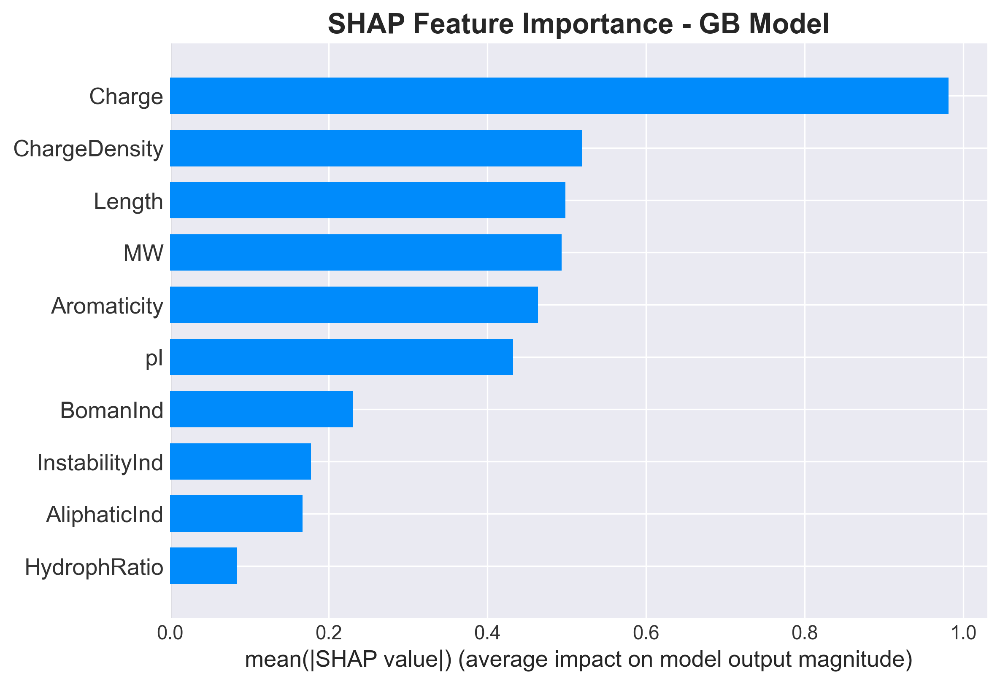

**Análise:** A barra de `Charge` é desproporcionalmente grande. O GB é essencialmente um "Detector de Cátions Avançado".

### 2.3 Interações Específicas

**Comprimento vs Aromaticidade:**
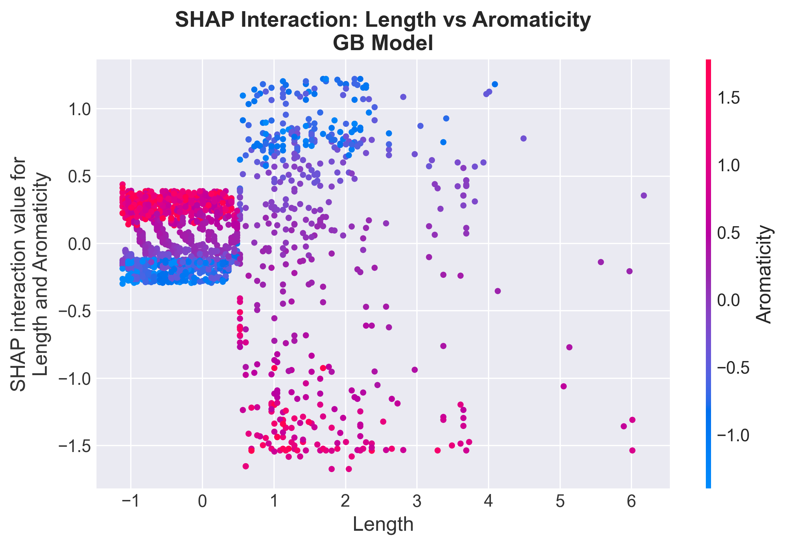
> O GB também encontrou essa relação biológica, validando o achado do Random Forest.

### 2.4 Dependence Plots (Detalhes de Features)

**Charge Dependence:**
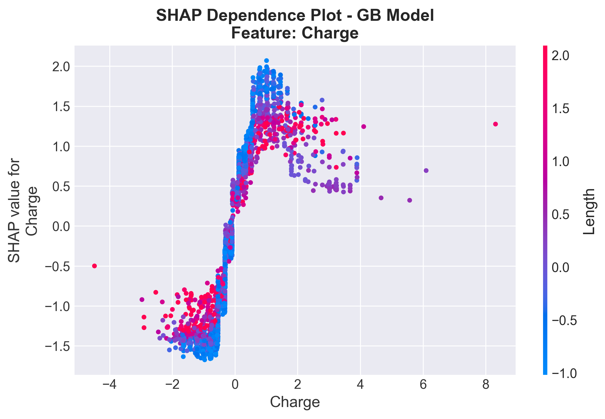
> Mostra uma relação quase linear ou sigmoidal: quanto maior a carga, maior o SHAP value, até certo ponto de saturação.

---

## 3. Support Vector Machine (SVM) - O Modelo "Estrutural/Geométrico"

O SVM com kernel RBF oferece uma perspectiva **completamente diferente**, focando na geometria do peptídeo.

### 3.1 Summary Plot

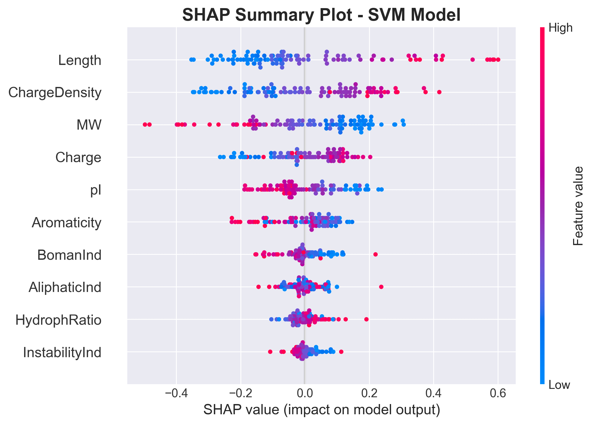

**Surpresa Científica:**
*   **Length - Muita Superioridade:** Ao contrário das árvores, o SVM colocou `Length` e `MW` no topo.
*   **Interpretação:** O SVM encontrou um hiperplano onde separar "pequeno vs grande" é mais eficaz matematicamente do que separar "positivo vs negativo" como primeiro passo.
*   **Complementaridade:** Isso faz do SVM um excelente parceiro para o RF/GB, pois ele detectará AMPs que podem falhar no critério estrito de carga, mas que têm a estrutura correta.

### 3.2 Decision Plot

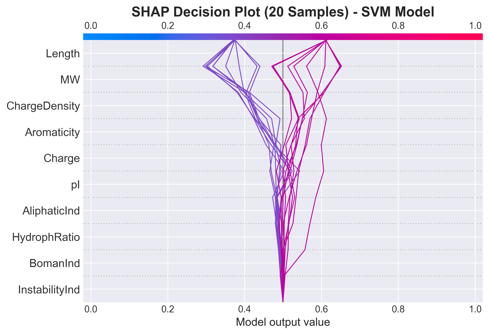

**Análise:** As trajetórias são mais suaves e curvadas do que nas árvores, refletindo a natureza contínua do kernel RBF, em oposição aos cortes discretos das árvores de decisão.

---

## 4. Comparação Cruzada Final

### Features Consensuais vs Divergentes

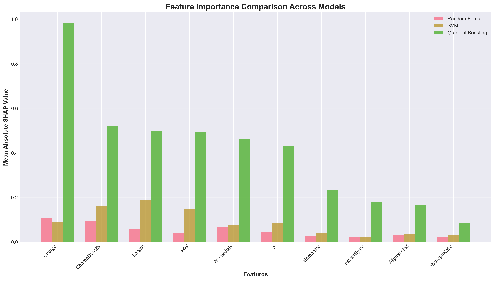

1.  **Consenso:** `ChargeDensity` é vital para todos.
2.  **Divergência:** `Length` é vital para SVM, secundário para RF/GB.
3.  **Conclusão Biológica:** Para criar um preditor de AMP perfeito, você precisa de ambos: a **química** (capturada pelo GB/RF) e a **forma** (capturada pelo SVM).