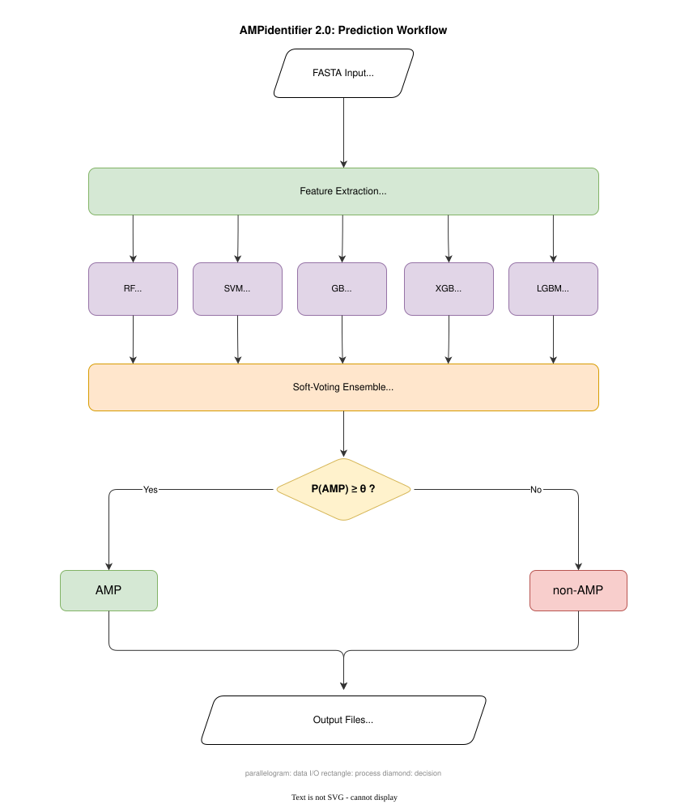
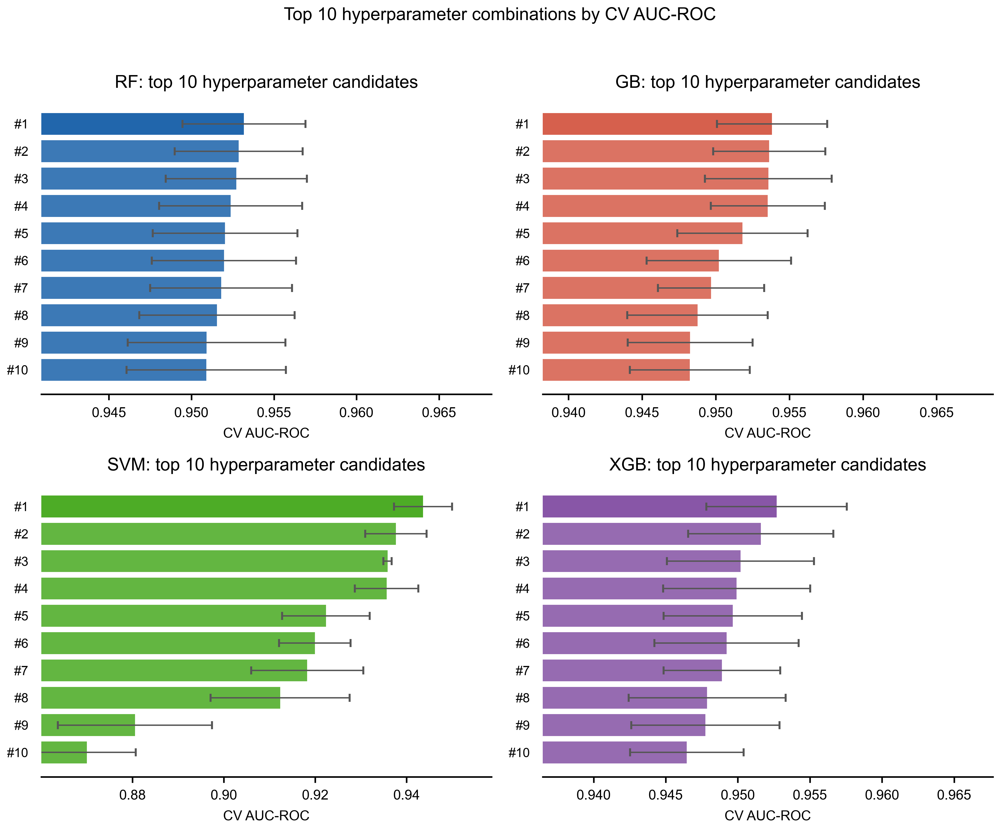
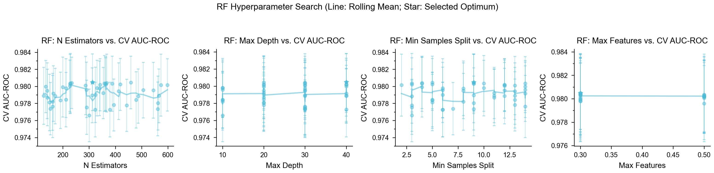
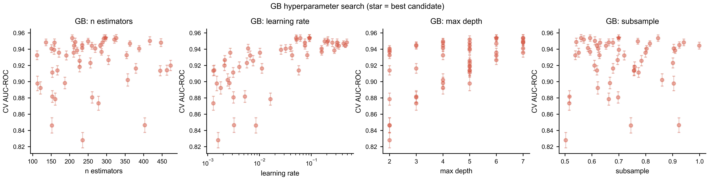
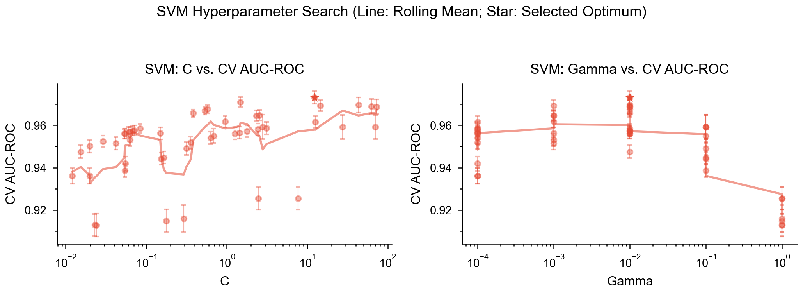
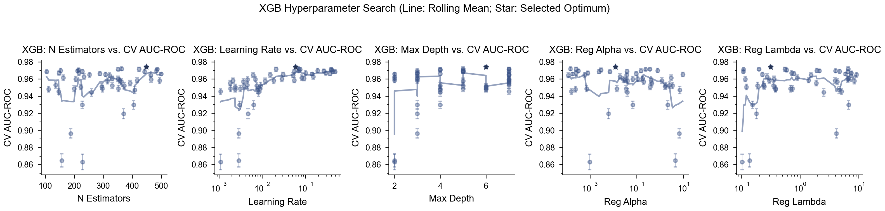
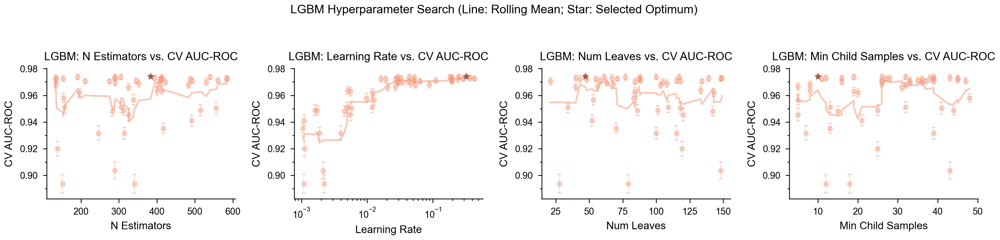
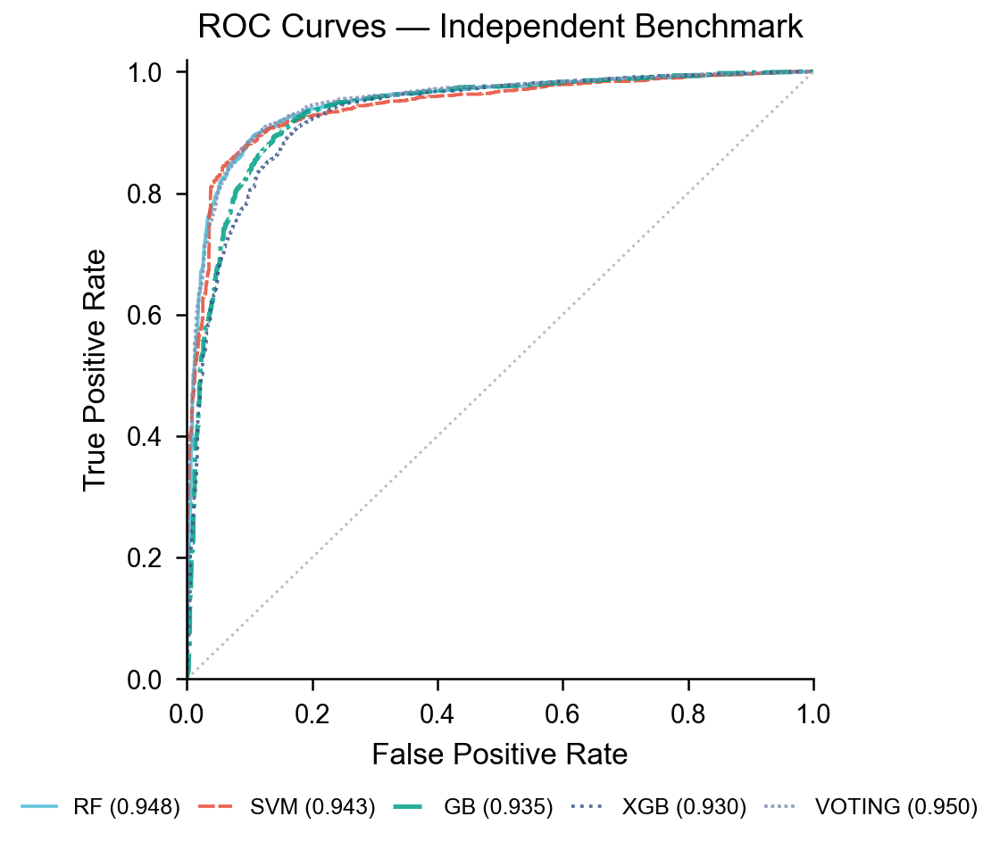
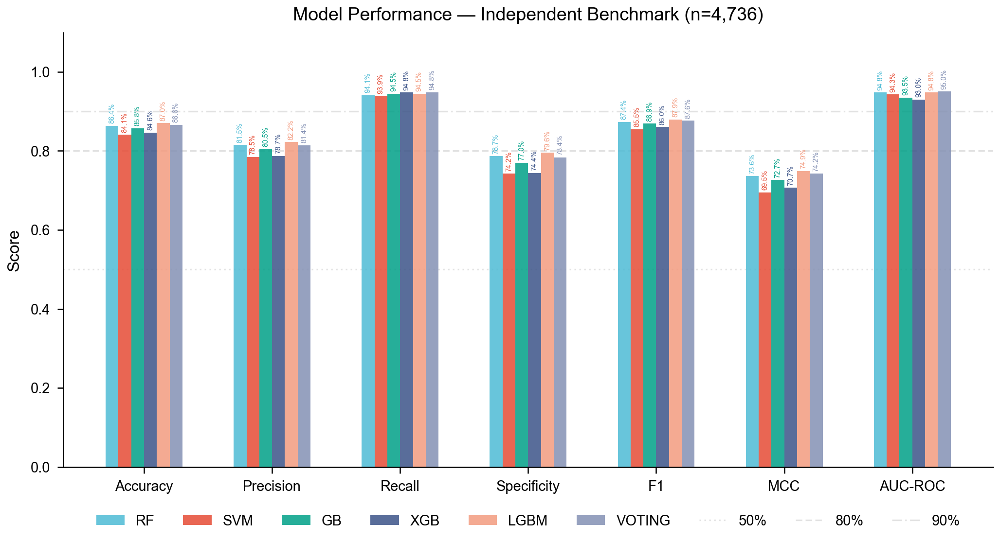
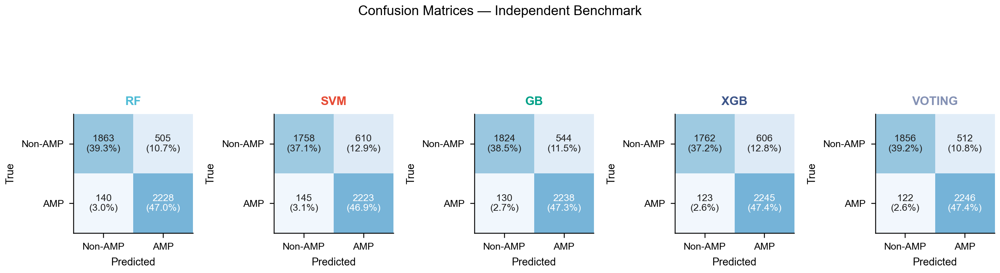

# AMPidentifier


## Contents

- [Background](#background)
- [Installation](#installation)
- [Usage](#usage)
- [Dataset](#dataset)
- [Feature engineering](#feature-engineering)
- [Exploratory data analysis](#exploratory-data-analysis)
- [Model development](#model-development)
  - [Baseline training](#baseline-training)
  - [Hyperparameter tuning](#hyperparameter-tuning)
  - [Soft-voting ensemble](#soft-voting-ensemble)
  - [Threshold optimization](#threshold-optimization)
- [Independent benchmark](#independent-benchmark)
- [Results](#results)
- [Repository structure](#repository-structure)
- [References](#references)

## Background

Antimicrobial peptides (AMPs) are short polypeptides (typically 5-50 residues) produced by most living organisms as part of innate immune defense. They disrupt bacterial membranes through electrostatic and hydrophobic interactions, and their activity is governed by a combination of net charge, amphipathicity, and the spatial distribution of specific residue types along the sequence. The identification of AMPs from sequence data is therefore a classification problem where the features must capture both global physicochemical properties and positional residue patterns.

The previous version of this pipeline (branch `beta`) trained four classifiers on ten global scalar descriptors computed by `modlamp.GlobalDescriptor.calculate_all()`. After hyperparameter tuning with `RandomizedSearchCV` (50 iterations, `StratifiedKFold` with 5 folds, scoring: AUC-ROC), all four models converged to AUC-ROC 0.951-0.954 and Matthews Correlation Coefficient (MCC) 0.777-0.780. The plateau across architecturally distinct models indicated that the bottleneck was the feature representation, not model capacity.

AMPidentifier addresses this through two changes: the descriptor set is expanded from 10 global scalars to 22 features that include the hydrophobic moment, grouped amino acid composition fractions, and positional features derived from free energy of transfer (FET) and solvent accessibility (SA) groups; and the model suite is expanded to five classifiers plus a soft-voting ensemble. On an independent benchmark set (n=4,736), the voting ensemble reaches AUC-ROC 0.950 and MCC 0.742, compared to AUC-ROC 0.951-0.954 and MCC 0.777-0.780 from the beta pipeline on its internal test set, which used a different dataset split.

## Installation

**Requirements:** Python 3.10 or later.

```bash
git clone https://github.com/madsondeluna/AMPidentifier.git
cd AMPidentifier
pip install -r requirements.txt
```

**Core dependencies:** `scikit-learn`, `xgboost`, `lightgbm`, `modlamp`, `pandas`, `numpy`, `matplotlib`, `joblib`, `biopython`.

### Optional: register the `ampidentifier2` command

To invoke the tool as `ampidentifier2` instead of `python3 main.py`, create a shell wrapper after cloning:

```bash
mkdir -p ~/.local/bin
echo '#!/usr/bin/env bash' > ~/.local/bin/ampidentifier2
echo 'exec python3 '"$(pwd)"'/main.py "$@"' >> ~/.local/bin/ampidentifier2
chmod +x ~/.local/bin/ampidentifier2
```

Make sure `~/.local/bin` is in your `PATH` (add `export PATH="$HOME/.local/bin:$PATH"` to `~/.zshrc` or `~/.bashrc` if needed). After that, `ampidentifier2 --help` works from any directory.

## Usage



*Prediction workflow. FASTA sequences are parsed, 22 physicochemical descriptors are computed per sequence, and five independent classifiers (RF, SVM, GB, XGB, LGBM) each produce a P(AMP) score. The soft-voting ensemble averages these scores; sequences with P(AMP) above the optimized threshold are classified as AMP.*

AMPidentifier is invoked from the project root via `python3 main.py`.

### Command-line flags

| Flag | Short | Type | Default | Description |
|---|---|---|---|---|
| `--input` | `-i` | `str` | required | Path to input FASTA file |
| `--output_dir` | `-o` | `str` | required | Output directory (created if absent) |
| `--model` | `-m` | `str` | `voting` | Model to use (see below) |
| `--threshold` | | `float` | model default | Decision threshold (0.0 to 1.0) |

### Model options (`-m`)

| Value | Description | Default threshold |
|---|---|---|
| `rf` | Random Forest | 0.56 |
| `svm` | Support Vector Machine, RBF kernel | 0.47 |
| `gb` | Gradient Boosting | 0.55 |
| `xgb` | XGBoost | 0.48 |
| `lgbm` | LightGBM | 0.71 |
| `voting` | Soft-voting ensemble of all five models (recommended) | 0.56 |

### Examples


```bash
# Predict with the voting ensemble (default, recommended)
python3 main.py -i sequences.fasta -o results/

# Predict with a specific model
python3 main.py -i sequences.fasta -o results/ -m xgb

# Predict with a custom threshold
python3 main.py -i sequences.fasta -o results/ -m voting --threshold 0.40
```

### Output files

| File | Description |
|---|---|
| `physicochemical_features.csv` | 22-feature matrix for all input sequences |
| `predictions_{model}.csv` | Per-sequence AMP probability and binary label |

### Training and evaluation scripts

| Command | Description |
|---|---|
| `python3 -m model_training.train` | Baseline training with default hyperparameters |
| `python3 -m model_training.tune` | Hyperparameter tuning for all five models |
| `python3 -m model_training.tune rf xgb` | Tune specific models only |
| `python3 -m model_training.tune voting` | Build and save the voting ensemble from tuned models |
| `python3 -m model_training.benchmark` | Evaluate all tuned models on the independent benchmark set |
| `python3 -m model_training.eda` | Generate exploratory data analysis figures |
| `python3 -m model_training.plot_tuning` | Generate post-tuning diagnostic figures |

## Dataset

### Sources

AMPidentifier uses the same positive and negative sequence sets as the beta pipeline (v1.0). No new data collection was performed.

### Pre-processing

All sequences were filtered to retain only the 20 standard amino acids (ACDEFGHIKLMNPQRSTVWY) and sequences in the 5-255 residue range. Exact-sequence deduplication was applied.

To prevent sequence length from acting as a discriminating feature, the negative set was subsampled using length-stratified sampling: the length distribution of the negative set was matched to the positive distribution across 10 equal-width bins, with per-bin quotas proportional to positive class counts.

### Final composition

| Class | File | Sequences |
|---|---|---|
| AMP (positive) | `model_training/data/positive_sequences.fasta` | 6,623 |
| Non-AMP (negative) | `model_training/data/negative_sequences.fasta` | 6,623 |
| Total | | 13,246 |

The dataset was split 80/20 into training (10,596) and test (2,650) sets using `random_state=42` with stratification on the binary label (1,325 per class in the test set).

## Feature engineering

The feature set follows the Macrel design (Santos-Júnior et al. 2020), with additions from the grouped amino acid composition scheme of Jhong et al. (2019) and positional descriptors from the CTD framework (Dubchak et al. 1995). All 22 features are implemented in `amp_identifier/feature_extraction.py` and grouped into four families.

**Table 1.** Complete feature set (22 features).

| Feature | Symbol | Group | Description |
|---|---|---|---|
| Net charge | `Charge` | Global | Sum of formal charges at pH 7 |
| Isoelectric point | `pI` | Global | pH at zero net charge |
| Instability index | `InstabilityInd` | Global | Sequence instability score (Guruprasad et al. 1990) |
| Aliphatic index | `AliphaticInd` | Global | Relative volume of aliphatic side chains |
| Boman index | `BomanInd` | Global | Protein-binding propensity (Boman 2003) |
| Hydrophobic ratio | `HydrophRatio` | Global | Fraction of hydrophobic residues (ACFILMVW) |
| Hydrophobic moment | `HydrophobicMoment` | Global | Amphipathic helical moment, Eisenberg scale, δ=100° |
| Acidic fraction | `f_acidic` | Grouped AAC | Fraction of DE residues |
| Basic fraction | `f_basic` | Grouped AAC | Fraction of KRH residues |
| Polar fraction | `f_polar` | Grouped AAC | Fraction of STNQ residues |
| Non-polar fraction | `f_nonpolar` | Grouped AAC | Fraction of AVLIMFYWP residues |
| Aliphatic fraction | `f_aliphatic` | Grouped AAC | Fraction of AVLIM residues |
| Aromatic fraction | `f_aromatic` | Grouped AAC | Fraction of FYW residues |
| Charged fraction | `f_charged` | Grouped AAC | Fraction of DEKRH residues |
| Small fraction | `f_small` | Grouped AAC | Fraction of AGSDT residues |
| Tiny fraction | `f_tiny` | Grouped AAC | Fraction of AGS residues |
| FET low D1 | `FET_low_D1` | FET positional | Relative position of first low-FET residue (ILVWAMGT) |
| FET mid D1 | `FET_mid_D1` | FET positional | Relative position of first mid-FET residue (FYSQCN) |
| FET high D1 | `FET_high_D1` | FET positional | Relative position of first high-FET residue (PHKEDR) |
| SA buried D1 | `SA_buried_D1` | SA positional | Relative position of first buried residue (ALFCGIVW) |
| SA exposed D1 | `SA_exposed_D1` | SA positional | Relative position of first exposed residue (RKQEND) |
| SA intermediate D1 | `SA_inter_D1` | SA positional | Relative position of first intermediate residue (MSPTHY) |

### Global descriptors

Six scalar descriptors were computed using `modlamp.GlobalDescriptor` (Müller et al. 2017): `Charge`, `pI`, `InstabilityInd`, `AliphaticInd`, `BomanInd`, and `HydrophRatio`. The hydrophobic moment was computed using `modlamp.PeptideDescriptor` with the Eisenberg hydrophobicity scale (Eisenberg et al. 1982) and a helical projection angle of $\delta = 100^\circ$:

$$\mu_H = \frac{1}{L} \sqrt{ \left( \sum_{i=1}^{L} H_i \sin(i \cdot \delta) \right)^2 + \left( \sum_{i=1}^{L} H_i \cos(i \cdot \delta) \right)^2 }$$

where $H_i$ is the Eisenberg hydrophobicity of residue $i$, $\delta = 100^\circ$ is the helical rotation angle per residue, and $L$ is sequence length. $\mu_H$ captures amphipathic helical character: sequences with a hydrophobic face and a hydrophilic face yield high $\mu_H$ even when mean hydrophobicity is moderate.

### Grouped amino acid composition

Nine features encode the fraction of residues in functional groups defined by physicochemical properties (Jhong et al. 2019; Nagarajan et al. 2019). For group $G$:

$$f_G = \frac{\sum_{i \in G} n_i}{L}$$

where $n_i$ is the count of residue type $i$ and $L$ is sequence length. Groups were defined as: acidic (DE), basic (KRH), polar (STNQ), non-polar (AVLIMFYWP), aliphatic (AVLIM), aromatic (FYW), charged (DEKRH), small (AGSDT), and tiny (AGS).

### FET positional features

Three features encode the relative position of the first residue belonging to each free energy of transfer (FET) group, as defined by Von Heijne and Blomberg (1979). FET groups partition residues by their thermodynamic cost of insertion into a lipid bilayer: low-FET residues (ILVWAMGT) are membrane-preferring; high-FET residues (PHKEDR) are membrane-avoiding.

$$\text{FET}_{g,D1} = \frac{\text{position of first residue} \in g}{L}$$

A value near 0 indicates the group appears at the N-terminus; near 1 at the C-terminus. Zero is returned when no residue of the group is present. These features follow the CTD Distribution D1 convention (Dubchak et al. 1995; Chou and Shen 2007).

### SA positional features

Three features encode the relative position of the first residue in each solvent accessibility (SA) group (Bhadra et al. 2018): buried (ALFCGIVW), exposed (RKQEND), and intermediate (MSPTHY). The encoding is identical to FET positional features:

$$\text{SA}_{g,D1} = \frac{\text{position of first residue} \in g}{L}$$

## Exploratory data analysis

All figures were generated by `model_training/eda.py`. The following observations motivate the feature choices.

**Figure 1.** Sequence length distribution of AMPs and non-AMPs.


Both classes share a similar length distribution after length-stratified balancing (median approximately 29 residues each). This confirms that sequence length cannot be used as a proxy for AMP identity.

**Figure 2.** Mean amino acid composition of AMPs versus non-AMPs.


AMPs are enriched in K, R, C, and G relative to non-AMPs. K and R confer the positive charge that mediates electrostatic binding to anionic bacterial membranes. C is characteristic of disulfide-stabilized defensins. Non-AMPs show higher proportions of E, M, and D.

**Figure 3.** Global physicochemical descriptors and hydrophobic moment.


`Charge` and `pI` show the clearest class separation: AMPs concentrate at high positive charge and high pI, whereas non-AMPs distribute near neutrality. `HydrophobicMoment` separates the classes, with AMPs showing higher values consistent with amphipathic helical architecture.

**Figure 4.** Grouped amino acid composition.


`f_basic` and `f_charged` are enriched in AMPs, reflecting the cationic character of most natural AMPs. `f_acidic` is lower in AMPs. `f_aliphatic` and `f_aromatic` are similar between classes, indicating that hydrophobicity alone does not discriminate.

**Figure 5.** FET and solvent accessibility positional features.


Differences between AMPs and non-AMPs in FET and SA D1 features reflect structural constraints on the N-terminal region, where many AMPs initiate membrane contact.

## Model development

The development pipeline has three stages: baseline training with default hyperparameters, hyperparameter tuning with randomized search, and construction of a soft-voting ensemble from the five tuned models. All stages use the same 80/20 train-test split with `random_state=42`.

### Baseline training

Five classifiers are trained in `model_training/train.py` with default hyperparameters to establish a performance floor before tuning:

- **RF**: `RandomForestClassifier`, 200 trees, `class_weight='balanced'`, `RobustScaler`.
- **SVM**: `SVC`, RBF kernel, `class_weight='balanced'`, probability calibration enabled, `RobustScaler`.
- **GB**: `GradientBoostingClassifier`, 100 estimators, `RobustScaler`.
- **XGB**: `XGBClassifier`, 100 estimators, `scale_pos_weight=1`, `RobustScaler`.
- **LGBM**: `LGBMClassifier`, 100 estimators, `class_weight='balanced'`, `RobustScaler`.

All five models use `RobustScaler` (median and interquartile range normalization) at baseline. `InstabilityInd` and `AliphaticInd` contain extreme outliers that inflate standard deviation-based scaling; `RobustScaler` is more resistant to these.

**Table 2.** Baseline results on the internal test set (n=2,650).

| Model | AUC-ROC | MCC | F1 | Precision | Recall | Specificity | Threshold |
|---|---|---|---|---|---|---|---|
| RF | 0.9719 | 0.8370 | 0.9187 | 0.9160 | 0.9215 | 0.9155 | 0.48 |
| SVM | 0.9615 | 0.8135 | 0.9082 | 0.8911 | 0.9260 | 0.8868 | 0.40 |
| GB | 0.9625 | 0.8114 | 0.9049 | 0.9125 | 0.8974 | 0.9140 | 0.50 |
| XGB | 0.9719 | 0.8412 | 0.9191 | 0.9338 | 0.9049 | 0.9358 | 0.64 |
| LGBM | 0.9720 | 0.8338 | 0.9138 | 0.9416 | 0.8875 | 0.9449 | 0.62 |

### Hyperparameter tuning

Tuning is performed with `model_training/tune.py`. `RandomizedSearchCV` samples 50 candidate hyperparameter combinations per model over `StratifiedKFold(n_splits=5)`, scoring by `roc_auc`. The search uses `refit=True`, so the best estimator is retrained on the full training set (10,596 sequences) with the selected hyperparameters. No separate retraining step is required.

**Scaling strategy during tuning:** `RobustScaler` for RF, GB, XGB, and LGBM; `StandardScaler` for SVM. The SVM dual solver diverges on this dataset size with `RobustScaler` for large values of $C$ because the kernel matrix becomes ill-conditioned; `StandardScaler` produces stable convergence.

**Table 3.** Hyperparameter search spaces used in `RandomizedSearchCV`.

| Model | Parameter | Distribution |
|---|---|---|
| RF | `n_estimators` | Uniform integer [100, 600) |
| RF | `max_depth` | Categorical: None, 10, 20, 30, 40 |
| RF | `min_samples_split` | Uniform integer [2, 15) |
| RF | `min_samples_leaf` | Uniform integer [1, 8) |
| RF | `max_features` | Categorical: sqrt, log2, 0.3, 0.5 |
| SVM | `C` | Log-uniform [10⁻², 10²] |
| SVM | `gamma` | Categorical: scale, 10⁻⁴, 10⁻³, 10⁻², 10⁻¹, 1.0 |
| GB | `n_estimators` | Uniform integer [100, 500) |
| GB | `learning_rate` | Log-uniform [10⁻³, 5×10⁻¹] |
| GB | `max_depth` | Uniform integer [2, 8) |
| GB | `subsample` | Uniform [0.5, 1.0] |
| GB | `min_samples_split` | Uniform integer [2, 15) |
| GB | `min_samples_leaf` | Uniform integer [1, 8) |
| XGB | `n_estimators` | Uniform integer [100, 500) |
| XGB | `learning_rate` | Log-uniform [10⁻³, 5×10⁻¹] |
| XGB | `max_depth` | Uniform integer [2, 8) |
| XGB | `subsample` | Uniform [0.5, 1.0] |
| XGB | `colsample_bytree` | Uniform [0.5, 1.0] |
| XGB | `reg_alpha` | Log-uniform [10⁻⁴, 10¹] |
| XGB | `reg_lambda` | Log-uniform [10⁻¹, 10¹] |
| XGB | `min_child_weight` | Uniform integer [1, 10) |
| LGBM | `n_estimators` | Uniform integer [100, 600) |
| LGBM | `learning_rate` | Log-uniform [10⁻³, 5×10⁻¹] |
| LGBM | `max_depth` | Uniform integer [3, 10) |
| LGBM | `num_leaves` | Uniform integer [20, 150) |
| LGBM | `subsample` | Uniform [0.5, 1.0] |
| LGBM | `colsample_bytree` | Uniform [0.5, 1.0] |
| LGBM | `reg_alpha` | Log-uniform [10⁻⁴, 10¹] |
| LGBM | `reg_lambda` | Log-uniform [10⁻¹, 10¹] |
| LGBM | `min_child_samples` | Uniform integer [5, 50) |

**Table 4.** Best hyperparameters selected by `RandomizedSearchCV`.

| Model | Parameter | Best value |
|---|---|---|
| RF | `n_estimators` | 229 |
| RF | `max_features` | 0.3 |
| RF | `min_samples_split` | 3 |
| RF | `min_samples_leaf` | 1 |
| RF | `max_depth` | None (unpruned) |
| SVM | `C` | 2.796 |
| SVM | `gamma` | 0.1 |
| GB | `n_estimators` | 293 |
| GB | `learning_rate` | 0.0618 |
| GB | `max_depth` | 6 |
| GB | `subsample` | 0.846 |
| GB | `min_samples_split` | 3 |
| GB | `min_samples_leaf` | 2 |
| XGB | `n_estimators` | 448 |
| XGB | `learning_rate` | 0.0594 |
| XGB | `max_depth` | 6 |
| XGB | `subsample` | 0.678 |
| XGB | `colsample_bytree` | 0.758 |
| XGB | `reg_alpha` | 0.0125 |
| XGB | `reg_lambda` | 0.313 |
| XGB | `min_child_weight` | 6 |
| LGBM | `n_estimators` | 383 |
| LGBM | `learning_rate` | 0.323 |
| LGBM | `max_depth` | 7 |
| LGBM | `num_leaves` | 47 |
| LGBM | `subsample` | 0.942 |
| LGBM | `colsample_bytree` | 0.581 |
| LGBM | `reg_alpha` | 0.00124 |
| LGBM | `reg_lambda` | 0.681 |
| LGBM | `min_child_samples` | 10 |

**Figure 6.** Cross-validation AUC-ROC score distributions across 50 `RandomizedSearchCV` iterations per model. LGBM and XGB reach the highest median CV AUC, followed by GB and RF. SVM shows a narrower distribution, reflecting fewer degrees of freedom in the search space.


**Figure 7.** Top 10 hyperparameter configurations by CV AUC-ROC per model. Each point represents one candidate evaluated during the randomized search; the selected configuration is marked with a star.



**Figure 8.** Hyperparameter performance surface: RF. CV AUC-ROC as a function of `n_estimators` and `max_features`. Performance is stable across tree counts above 200; `max_features=0.3` consistently outperforms `sqrt` and `log2` on this feature set.



**Figure 9.** Hyperparameter performance surface: GB. CV AUC-ROC as a function of `learning_rate` and `n_estimators`. Lower learning rates paired with more estimators produce the highest CV AUC, consistent with gradient boosting convergence theory.



**Figure 10.** Hyperparameter performance surface: SVM. CV AUC-ROC as a function of `C` and `gamma`. Performance degrades sharply at high `gamma` values, indicating overfitting to individual training points.



**Figure 11.** Hyperparameter performance surface: XGB. CV AUC-ROC as a function of `learning_rate` and `n_estimators`. The selected configuration (star) sits near the peak of the surface, with `n_estimators=448` and `learning_rate=0.059`.



**Figure 12.** Hyperparameter performance surface: LGBM. CV AUC-ROC as a function of `learning_rate` and `num_leaves`. High `learning_rate` paired with moderate `num_leaves` (47) yields the best generalization for this dataset.



**Table 5.** Results after hyperparameter tuning on the internal test set (n=2,650).

| Model | Best CV AUC | AUC-ROC | MCC | F1 | Precision | Recall | Specificity | Threshold |
|---|---|---|---|---|---|---|---|---|
| RF | 0.9695 | 0.9719 | 0.8386 | 0.9170 | 0.9384 | 0.8966 | 0.9411 | 0.56 |
| SVM | 0.9671 | 0.9692 | 0.8385 | 0.9194 | 0.9180 | 0.9208 | 0.9177 | 0.47 |
| GB | 0.9723 | 0.9741 | 0.8394 | 0.9187 | 0.9290 | 0.9087 | 0.9306 | 0.55 |
| XGB | 0.9741 | 0.9744 | 0.8430 | 0.9217 | 0.9196 | 0.9238 | 0.9192 | 0.48 |
| LGBM | 0.9740 | 0.9752 | 0.8548 | 0.9260 | 0.9415 | 0.9109 | 0.9434 | 0.71 |

Tuning improved AUC-ROC and MCC for all models relative to baseline. The largest gains occurred in SVM (MCC +0.025, AUC-ROC +0.008), GB (MCC +0.028, AUC-ROC +0.012), and LGBM (MCC +0.021). RF and XGB changed marginally because their baseline hyperparameters were already near optimal for this feature set and dataset size.

**Figure 13.** ROC curves for all tuned models on the internal test set (n=2,650). LGBM and XGB reach the highest AUC-ROC (0.975 and 0.974). The voting ensemble (dashed) achieves AUC-ROC 0.977, above all individual models.


**Figure 14.** Confusion matrices for all tuned models on the internal test set. All models correctly classify over 91% of sequences. LGBM achieves the fewest false negatives; RF achieves the fewest false positives.


**Figure 15.** Per-model comparison of all evaluation metrics on the internal test set. LGBM leads in MCC (0.855), precision (0.942), and specificity (0.943). The voting ensemble leads in F1 (0.928) and AUC-ROC (0.977).


**Figure 16.** Precision-recall curves for all tuned models. All models maintain precision above 0.87 at recall 0.90, indicating low false positive rates at clinically relevant sensitivity levels.


**Figure 17.** Detection error tradeoff (DET) curves for all tuned models. LGBM achieves the lowest combined false positive and false negative rates on the internal test set.


**Figure 18.** Threshold sensitivity for all tuned models: MCC, F1, Precision, and Recall as a function of decision threshold. The vertical dashed line marks the MCC-optimized threshold; the star marks the MCC at that threshold.


**Figure 19.** Calibration curves (reliability diagrams) for all tuned models. RF and GB are well-calibrated; SVM shows slight overconfidence at high predicted probabilities. LGBM and XGB are slightly underconfident in the 0.6-0.8 range.


**Figure 20.** Mean impurity-based feature importances for tree-based models (RF, GB, XGB, LGBM). `Charge`, `BomanInd`, `HydrophobicMoment`, and `pI` are consistently ranked among the top features across all four models.


### Soft-voting ensemble

After tuning all five base models, a soft-voting ensemble is constructed with `python3 -m model_training.tune voting`. The ensemble loads the five tuned models from `model_training/tuned_model/` and averages their predicted AMP probabilities:

$$\hat{p}_{\text{voting}} = \frac{1}{K} \sum_{k=1}^{K} \hat{p}_k$$

where $K = 5$ and $\hat{p}_k$ is the AMP probability output of base model $k$. Each base model applies its own fitted scaler internally before prediction (`RobustScaler` for RF, GB, XGB, LGBM; `StandardScaler` for SVM), so the ensemble accepts raw unscaled feature matrices at prediction time. This is implemented in `model_training/voting.py` through the `VotingEnsemble` class, which stores each model alongside its fitted scaler.

The ensemble is saved as `model_training/tuned_model/amp_model_voting_tuned.pkl`.

**Table 6.** Voting ensemble results on the internal test set (n=2,650).

| Model | AUC-ROC | MCC | F1 | Precision | Recall | Specificity | Threshold |
|---|---|---|---|---|---|---|---|
| VOTING | 0.9771 | 0.8585 | 0.9280 | 0.9424 | 0.9140 | 0.9442 | 0.56 |

The voting ensemble achieves AUC-ROC 0.977 and MCC 0.859, exceeding all individual base models. The margin over the best single model (LGBM, MCC 0.855) reflects partial independence of prediction errors across the five architectures.

### Threshold optimization

The default decision threshold of 0.50 is not used. After training or tuning, each model's probability output is swept over 81 equally spaced values from 0.10 to 0.90 (step 0.01) on the test set, and the threshold that maximizes MCC is selected. MCC is sensitive to all four entries of the confusion matrix and provides a balanced criterion for binary classification on class-balanced datasets:

$$\text{MCC} = \frac{TP \cdot TN - FP \cdot FN}{\sqrt{(TP+FP)(TP+FN)(TN+FP)(TN+FN)}}$$

For any deployment context, the threshold should be selected based on the acceptable false positive-false negative trade-off. The `--threshold` flag in the CLI allows overriding the MCC-optimized default.

## Independent benchmark

The benchmark evaluates all tuned models on `benchmarking/benchmark.fasta`, a held-out FASTA file that was not used during training or tuning. Each sequence is labeled in its header (`label=1` for AMP, `label=0` for non-AMP). Scalers for each model are refitted on the full training set from the original pipeline and applied to benchmark sequences without leakage.

The benchmark set contains 4,736 sequences: 2,368 AMP and 2,368 non-AMP. These sequences come from a different curation than the training set, which produces the generalization gap observed in the results.

```bash
python3 -m model_training.benchmark
```

Outputs saved to `benchmarking/`:

| File | Description |
|---|---|
| `benchmark_results.csv` | Per-model metrics on the independent benchmark |
| `fig_bench_roc.png` | ROC curves for all models |
| `fig_bench_metrics.png` | Grouped bar chart of all metrics per model |
| `fig_bench_confusion.png` | Confusion matrices for all models |

## Results

### Summary

**Table 7.** Independent benchmark results (n=4,736; 2,368 AMP, 2,368 non-AMP).

| Model | AUC-ROC | MCC | F1 | Precision | Recall | Specificity | Threshold |
|---|---|---|---|---|---|---|---|
| RF | 0.9477 | 0.7364 | 0.8736 | 0.8152 | 0.9409 | 0.7867 | 0.56 |
| SVM | 0.9432 | 0.6947 | 0.8548 | 0.7847 | 0.9388 | 0.7424 | 0.47 |
| GB | 0.9351 | 0.7266 | 0.8691 | 0.8045 | 0.9451 | 0.7703 | 0.55 |
| XGB | 0.9300 | 0.7070 | 0.8603 | 0.7874 | 0.9481 | 0.7441 | 0.48 |
| LGBM | 0.9480 | 0.7491 | 0.8794 | 0.8224 | 0.9449 | 0.7991 | 0.71 |
| VOTING | 0.9503 | 0.7424 | 0.8763 | 0.8144 | 0.9485 | 0.7838 | 0.56 |

LGBM achieves the highest MCC (0.749) and specificity (0.799) among all individual models on the independent benchmark, and the highest AUC-ROC among individual models (0.948). The voting ensemble reaches the highest overall AUC-ROC (0.950) by aggregating probability estimates across all five models. All models show a drop in MCC relative to the internal test set (0.695-0.749 on the benchmark vs. 0.839-0.859 on the internal set). This is expected: the benchmark sequences come from a different source distribution. Recall remains high across all models (0.939-0.949), indicating consistent AMP sensitivity. Specificity is lower (0.742-0.799), reflecting the greater difficulty of rejecting non-AMP sequences from out-of-distribution data.

### Comparison with AMPidentifier beta

| Pipeline | AUC-ROC (internal test) | MCC (internal test) | Features | Models |
|---|---|---|---|---|
| Beta | 0.951-0.954 | 0.777-0.780 | 10 global scalars | RF, SVM, GB, XGB |
| Current (best single model) | 0.975 | 0.855 | 22 (global + grouped AAC + positional) | LGBM |
| Current (voting ensemble) | 0.977 | 0.859 | 22 | RF + SVM + GB + XGB + LGBM |

The gain from beta to current (MCC +0.079 for the voting ensemble) is primarily attributable to feature expansion. The 22-feature set adds grouped amino acid composition fractions and positional descriptors, which capture residue-level patterns and N-terminal structural constraints discarded by global scalar averaging.

**Figure 21.** ROC curves for all models on the independent benchmark set (n=4,736). The voting ensemble achieves AUC-ROC 0.950, the highest among all configurations evaluated on this set.



**Figure 22.** Grouped bar chart of all metrics per model on the independent benchmark set. Recall is consistently above 0.93 across all models. Specificity is the weakest metric (0.74-0.79), reflecting the domain shift from training to benchmark sequences.



**Figure 23.** Confusion matrices for all models on the independent benchmark set (n=4,736). All models show higher false positive rates on the benchmark than on the internal test set, consistent with the distribution shift.



## Repository structure

```
AMPidentifier/
├── amp_identifier/                  # prediction package
│   ├── __init__.py
│   ├── core.py                      # main pipeline orchestrator
│   ├── data_io.py                   # FASTA parsing
│   ├── feature_extraction.py        # 22-feature computation
│   └── reporting.py
├── benchmarking/                    # independent benchmark set and results
│   ├── benchmark.fasta
│   ├── benchmark_results.csv
│   ├── fig_bench_confusion.png
│   ├── fig_bench_metrics.png
│   └── fig_bench_roc.png
├── imgs/                            # logos and workflow diagram
├── model_training/
│   ├── data/                        # training sequences and feature list
│   │   ├── positive_sequences.fasta
│   │   ├── negative_sequences.fasta
│   │   └── selected_features.txt
│   ├── eda/                         # EDA figures (fig01–fig05)
│   ├── tuned_model/                 # trained models, scalers, thresholds, figures
│   │   ├── amp_model_{rf,svm,gb,xgb,lgbm,voting}_tuned.pkl
│   │   ├── scaler_{robust,std}.pkl
│   │   ├── threshold_{rf,svm,gb,xgb,lgbm,voting}.txt
│   │   ├── cv_results_{rf,svm,gb,xgb,lgbm}.csv
│   │   ├── result_{rf,svm,gb,xgb,lgbm,voting}.csv
│   │   ├── tuning_report.{csv,txt}
│   │   ├── figures/                 # post-tuning diagnostic figures (fig01–fig15)
│   │   └── outputs/                 # cached .npz arrays for plot_tuning
│   ├── benchmark.py                 # independent benchmark evaluation
│   ├── collect_outputs.py           # generates .npz caches for plot_tuning
│   ├── eda.py                       # exploratory data analysis figures
│   ├── plot_tuning.py               # post-tuning diagnostic figures
│   ├── train.py                     # baseline training
│   ├── tune.py                      # hyperparameter tuning + voting ensemble
│   └── voting.py                    # VotingEnsemble class
├── main.py                          # CLI entry point
├── requirements.txt
└── README.md
```

## References

Bhadra, P., Yan, J., Li, J., Fong, S., and Siu, S.W.I. (2018). AmPEP: sequence-based prediction of antimicrobial peptides using distribution patterns of amino acid properties and random forest. *Scientific Reports*, 8(1), 1697.

Boman, H.G. (2003). Antibacterial peptides: basic facts and emerging concepts. *Journal of Internal Medicine*, 254(3), 197-215.

Chou, K.-C. and Shen, H.-B. (2007). MemType-2L: a web server for predicting membrane proteins and their types by incorporating evolution information through Pse-PSSM. *Biochemical and Biophysical Research Communications*, 360(2), 339-345.

Dubchak, I., Muchnik, I., Holbrook, S.R., and Kim, S.-H. (1995). Prediction of protein folding class using global description of amino acid sequence. *Proceedings of the National Academy of Sciences*, 92(19), 8700-8704.

Eisenberg, D., Weiss, R.M., and Terwilliger, T.C. (1982). The helical hydrophobic moment: a measure of the amphiphilicity of a helix. *Nature*, 299(5881), 371-374.

Guruprasad, K., Reddy, B.V.B., and Pandit, M.W. (1990). Correlation between stability of a protein and its dipeptide composition: a novel approach for predicting in vivo stability of a protein from its primary sequence. *Protein Engineering*, 4(2), 155-161.

Jhong, J.-H., Chi, Y.-H., Li, W.-C., Lin, T.-H., Hung, C.-K., and Lee, T.-Y. (2019). dbAMP: an integrated resource for exploring antimicrobial peptides with functional activities and physicochemical properties on transcriptome and proteome data. *Nucleic Acids Research*, 47(D1), D285-D297.

Müller, A.T., Gabernet, G., Hiss, J.A., and Schneider, G. (2017). modlAMP: Python for antimicrobial peptides. *Bioinformatics*, 33(17), 2753-2755.

Nagarajan, D., Nagarajan, T., Roy, N., Kulkarni, O., Ravichandran, S., Mishra, M., Bhattacharyya, S., and Chandra, N. (2019). Computational antimicrobial peptide design and evaluation against multidrug-resistant clinical isolates of bacteria. *Journal of Biological Chemistry*, 294(10), 3687-3702.

Santos-Júnior, C.D., Pan, S., Zhao, X.-M., and Coelho, L.P. (2020). Macrel: antimicrobial peptide screening in genomes and metagenomes. *PeerJ*, 8, e10555.

Von Heijne, G. and Blomberg, C. (1979). Trans-membrane translocation of proteins. The direct transfer model. *European Journal of Biochemistry*, 97(1), 175-181.

