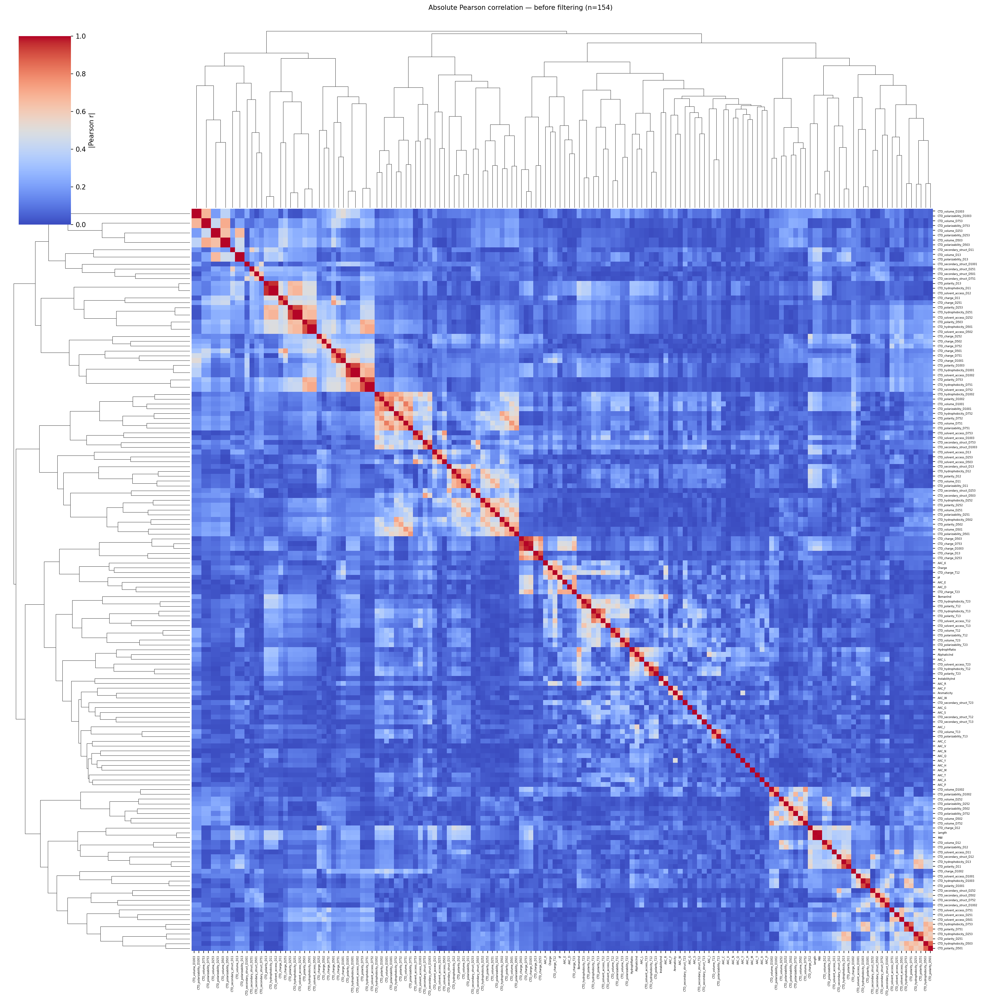
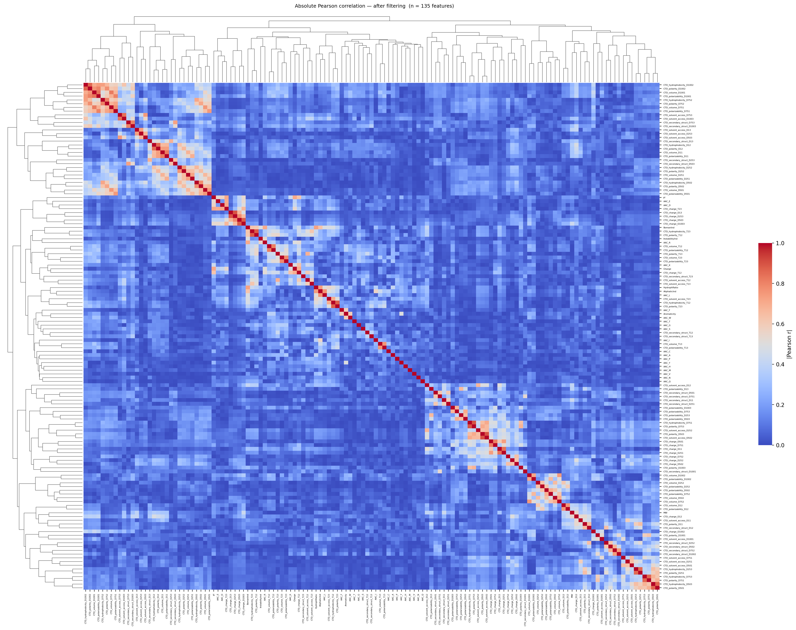
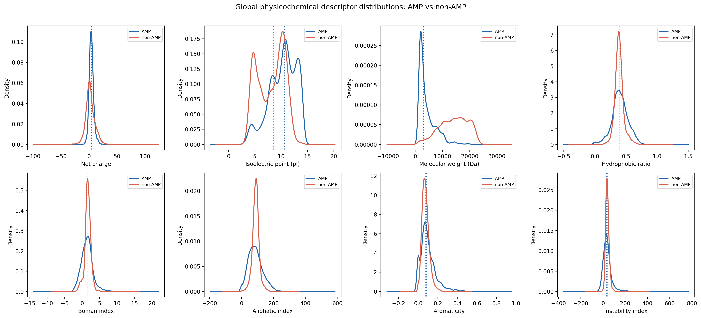
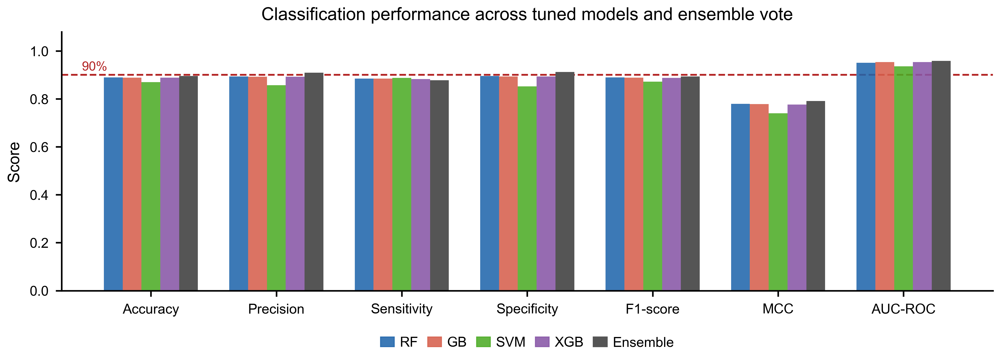
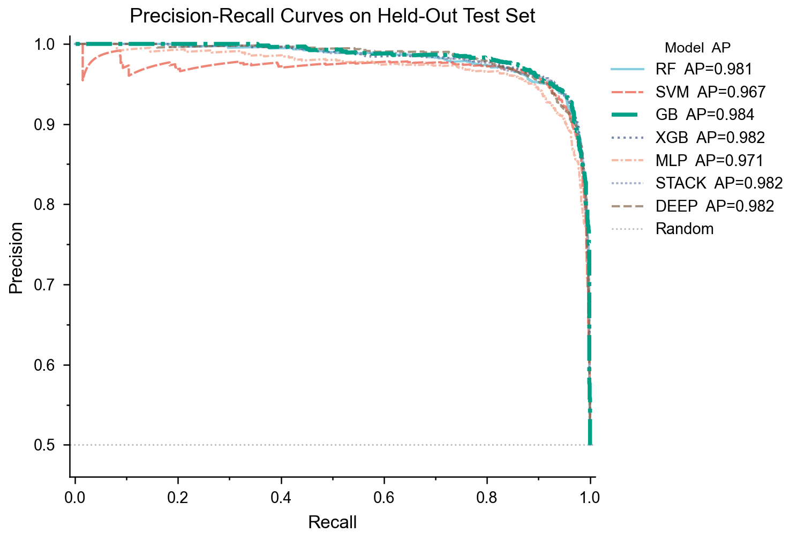
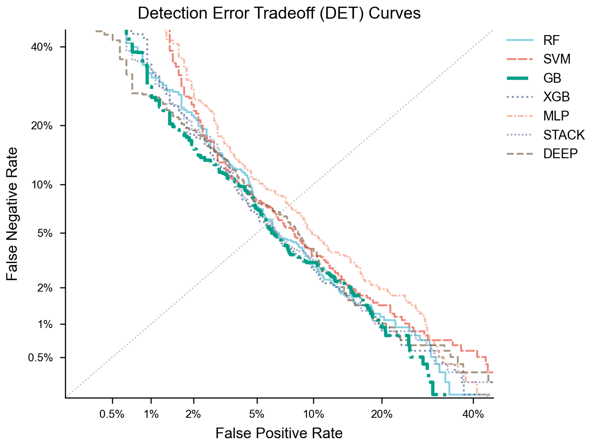
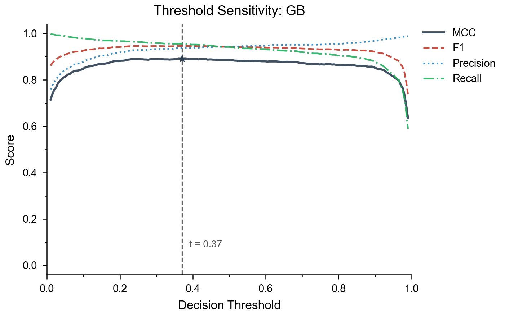

# AMPidentifier: expanded feature engineering and model development

Branch: `feature/expanded-features-deeplearning`

## Contents

- [Motivation](#motivation)
- [Dataset](#dataset)
- [Phase 1: Feature engineering](#phase-1-feature-engineering)
- [Phase 2: Feature selection](#phase-2-feature-selection)
- [Phase 2.5: Exploratory data analysis](#phase-25-exploratory-data-analysis)
- [Phase 3: Classical ML models (baseline)](#phase-3-classical-ml-models-baseline)
- [Phase 3.1: Hyperparameter tuning](#phase-31-hyperparameter-tuning)
- [Phase 4: Deep learning](#phase-4-deep-learning)
- [Phase 5: Independent benchmark evaluation](#phase-5-independent-benchmark-evaluation)
- [Figures](#figures)
- [Discussion](#discussion)
- [Known limitations and next steps](#known-limitations-and-next-steps)
- [References](#references)

## Motivation

The previous pipeline (branch `beta`) trained four classifiers, namely Random Forest (RF), Support Vector Machine (SVM), Gradient Boosting (GB), and XGBoost, on ten global physicochemical descriptors computed by `modlamp.GlobalDescriptor.calculate_all()`. After hyperparameter tuning with RandomizedSearchCV (50 iterations, StratifiedKFold with 5 folds, scoring: AUC-ROC), all four models converged to AUC-ROC 0.951-0.954 and Matthews Correlation Coefficient (MCC) 0.777-0.780. The plateau across architecturally distinct models indicated that the bottleneck was the feature representation rather than model capacity.

The features in `beta` are all global scalar values: molecular weight (MW), net charge, isoelectric point (pI), instability index, aromaticity, aliphatic index, Boman index, and hydrophobic ratio. These descriptors collapse the entire amino acid sequence into a single number per property, discarding all information about residue composition and positional distribution. Two peptides with identical charge but different distributions of charged residues along the chain receive the same feature vector. This collapse is the source of the information ceiling at MCC 0.78.

This branch addresses the ceiling through three parallel changes: feature expansion, feature selection, and the addition of new model architectures (MLP, stacking ensemble, and a PyTorch sequence-based model).

## Dataset

### Sources

Positive sequences (AMPs) were collected from three public databases and merged with the sequences already present in the repository:

| Source | Description | URL |
|---|---|---|
| APD3 2024 | Antimicrobial Peptide Database, natural AMP release 2024a | aps.unmc.edu |
| CAMPR3 | Collection of Antimicrobial Peptides, release 3 | www.camp3.bicnirrh.res.in |
| DRAMP 3.0 | Data Repository of Antimicrobial Peptides, general AMP set | dramp.cpu-bioinfor.org |

Negative sequences (non-AMPs) were downloaded from UniProt via the REST API (`rest.uniprot.org/uniprotkb/stream`) with the following query: reviewed sequences (`reviewed:true`), length between 10 and 200 residues, excluding keyword KW-0929 (Antimicrobial) and KW-0044 (Antibiotic). This query returned 176,001 candidate non-AMP sequences from Swiss-Prot.

### Pre-processing and deduplication

All downloaded sequences were filtered to remove:

- Sequences shorter than 10 residues or longer than 200 residues.
- Sequences containing non-standard amino acids (any character outside ACDEFGHIKLMNPQRSTVWY).

After filtering, positive and negative sets were each deduplicated independently using CD-HIT (v4.8.1) at 90% pairwise sequence identity (`-c 0.90 -n 5`). The 90% threshold is the standard for AMP datasets (Wang et al. 2009) and removes near-identical sequences without discarding distinct homologues. The two sets were then subsampled to equal size to maintain a balanced dataset.

All download and processing steps are implemented in `model_training/collect_sequences.py`. Downloaded files are cached in `model_training/data/raw_downloads/` and not re-fetched on subsequent runs.

### Final composition

| Class | File | Sequences |
|---|---|---|
| AMP (positive) | `model_training/data/positive_sequences.fasta` | 6,933 |
| Non-AMP (negative) | `model_training/data/negative_sequences.fasta` | 6,933 |
| Total | | 13,866 |

The 80/20 train-test split used `random_state=42` with stratification on the binary label. Training set: 11,092 sequences. Test set: 2,774 sequences (1,387 per class). Sequence length distributions are shown in Figure 3.

## Phase 1: Feature engineering

### Global descriptors

The ten descriptors from `modlamp.GlobalDescriptor.calculate_all(amide=True)` are retained from the `beta` pipeline: Length, MW, Charge, ChargeDensity, pI, InstabilityInd, Aromaticity, AliphaticInd, BomanInd, and HydrophRatio.

### Amino acid composition (AAC)

Twenty features were added, one per standard amino acid, each defined as the fraction of residues of that type in the sequence:

$$\text{AAC}_i = \frac{n_i}{L}$$

where $n_i$ is the count of amino acid $i$ and $L$ is the sequence length. AAC encodes residue content without positional information.

### Dipeptide composition (DPC)

Four hundred features were computed, one per ordered pair of amino acids $(i, j)$:

$$\text{DPC}_{ij} = \frac{n_{ij}}{L - 1}$$

where $n_{ij}$ is the count of consecutive pairs $i$-$j$ in the sequence. DPC incorporates short-range sequential context. As shown in Section Phase 2, DPC features have near-zero variance in this dataset and are removed during feature selection.

### CTD descriptors

One hundred and forty-seven features were computed using the Composition (C), Transition (T), and Distribution (D) framework of Dubchak et al. (1995), extended to seven physicochemical properties by Chou and Shen (2007): hydrophobicity, normalized van der Waals volume, polarity, polarizability, charge, secondary structure propensity, and solvent accessibility. Each property partitions the twenty standard amino acids into three groups (Table 1).

**Table 1.** CTD amino acid groupings (Chou and Shen 2007).

| Property | Group 1 | Group 2 | Group 3 |
|---|---|---|---|
| Hydrophobicity | RKEDQN | GASTPHY | CVLIMFW |
| Volume | GASTC | NDVEQIL | MHKFRYW |
| Polarity | LIFWCMVY | PATGS | HQRKNED |
| Polarizability | GASDT | CPNVEQIL | KMHFRYW |
| Charge | KR | ANCQGHILMFPSTWYV | DE |
| Secondary structure | EALMQKRH | VIYCWFT | GNPSD |
| Solvent accessibility | ALFCGIVW | RKQEND | MPSTHY |

For each property and each group $g \in \lbrace 1, 2, 3 \rbrace$, three descriptor types are computed:

**Composition** ($C_g$): fraction of residues belonging to group $g$:

$$C_g = \frac{n_g}{L}$$

**Transition** ($T_{g_1 g_2}$): fraction of consecutive residue pairs that switch between groups $g_1$ and $g_2$:

$$T_{g_1 g_2} = \frac{n_{g_1 g_2} + n_{g_2 g_1}}{L - 1}$$

**Distribution** ($D_{g,q}$): position of the $q$-th percentile occurrence of group $g$ as a fraction of sequence length, for $q \in \lbrace 1, 25, 50, 75, 100 \rbrace$:

$$D_{g,q} = \frac{\text{position of } q\text{-th percentile residue of group } g}{L}$$

Per property: 3 C + 3 T + 15 D = 21 values. Across 7 properties: 147 features.

The full feature vector after Phase 1 has 577 dimensions (10 GlobalDesc + 20 AAC + 400 DPC + 147 CTD). Feature extraction for 13,866 sequences runs in approximately 13.6 seconds on a single CPU.

## Phase 2: Feature selection

Feature selection was implemented in `model_training/feature_analysis.py` and proceeded in three sequential steps. The output is `model_training/data/selected_features.txt`.

### Step 1: Variance threshold

Features with variance $\leq 0.001$ were removed. The threshold was set at 0.001 rather than the conventional 0.01 because AAC features, which are proportions in short peptides, have intrinsically low variance: the highest AAC variance in the dataset was 0.0068 (`AAC_K`). A threshold of 0.01 eliminates all 20 AAC features.

Result: 577 reduced to 172. The 405 removed features were almost entirely DPC. Most of the 400 dipeptides are absent from the majority of sequences (mean length 34 residues), so their frequency distributions concentrate at zero with negligible spread.

### Step 2: Structural filter

All 21 CTD Composition features (CTD\_\*\_C1, CTD\_\*\_C2, CTD\_\*\_C3) were removed before pairwise correlation analysis. Two independent reasons justify this removal.

**Reason 1: Perfect multicollinearity within each property.** For any CTD property, $C_1 + C_2 + C_3 = 1$ by construction (Dubchak et al. 1995): the three groups partition all residues, so their composition fractions sum to one. If $C_1$ and $C_2$ are known, $C_3 = 1 - C_1 - C_2$ is determined exactly. This is perfect linear dependence, but pairwise Pearson filters do not detect it because the individual pairwise correlations are negative and below any reasonable threshold. For the charge property: $r(C_1, C_2) = -0.828$, $r(C_1, C_3) = -0.267$, $r(C_2, C_3) = -0.320$. Tree-based models tolerate this redundancy via node-level feature subsampling, but linear-kernel SVM and MLP face rank deficiency.

**Reason 2: Redundancy with AAC.** CTD Composition is a linear combination of AAC by construction. For the charge property:

```
CTD_charge_C1  =  AAC_K + AAC_R
CTD_charge_C3  =  AAC_D + AAC_E
```

Observed Pearson correlations confirm this: $r = 0.678$ for `AAC_K` versus `CTD_charge_C1`, and $r = 0.786$ for `AAC_E` versus `CTD_charge_C3`. Correlations below 1.0 because the groupings do not cover all amino acids in identical proportions, but the conceptual overlap is complete.

CTD Transition (T) and Distribution (D) features are retained: T encodes the frequency of property-class switches along the sequence; D encodes the positions of residues of each class as percentiles of sequence length. Neither is computable from AAC alone.

Result: 172 reduced to 151.

### Step 3: Pairwise Pearson correlation filter

One feature from each pair with $|r| > 0.90$ was removed. The threshold was set at 0.90 rather than the conventional 0.95 because nine pairs survived at 0.95 with $|r|$ between 0.91 and 0.94. The most correlated surviving pair at the 0.95 level was `CTD_polarity_C1` and `CTD_hydrophobicity_C3` ($r = 0.939$), explained by the near-complete overlap of their constituent amino acids: LIFWCMVY (polarity group 1) and CVLIMFW (hydrophobicity group 3) share 7 of 8 residues. Within each surviving pair, the feature with higher mean absolute correlation to all remaining features was dropped.

Result: 151 reduced to 127. No pair with $|r| > 0.90$ remains in the final set.

**Figure 1.** Pairwise absolute Pearson correlation of physicochemical features before filtering (n = 151).



**Figure 2.** Pairwise absolute Pearson correlation of physicochemical features after filtering (n = 127). The block structure in the lower-right region reflects within-property CTD grouping: Transition and Distribution features computed from the same physicochemical property are moderately correlated (shared residue groups, distinct sequence positions), but remain below the 0.90 threshold.



### Final feature set

**Table 2.** Composition of the 127 selected features.

| Group | Count | Description |
|---|---|---|
| GlobalDesc | 10 | MW, Charge, ChargeDensity, pI, InstabilityInd, Aromaticity, AliphaticInd, BomanInd, HydrophRatio, Length |
| AAC | 15 | Relative frequency of 15 amino acids (5 removed by variance and correlation filters) |
| CTD Transition (T) | 17 | Frequency of property-class switches along the chain |
| CTD Distribution (D) | 85 | Positional percentiles of each property class |
| **Total** | **127** | |

**Table 3.** Top 20 features by RF importance (313 trees, RobustScaler, training set).

| Rank | Feature | Importance |
|---|---|---|
| 1 | CTD_hydrophobicity_D13 | 0.1376 |
| 2 | CTD_polarizability_D13 | 0.0927 |
| 3 | CTD_solvent_access_D13 | 0.0864 |
| 4 | CTD_charge_D12 | 0.0765 |
| 5 | CTD_secondary_struct_D11 | 0.0649 |
| 6 | MW | 0.0614 |
| 7 | CTD_volume_D12 | 0.0215 |
| 8 | CTD_charge_D1003 | 0.0212 |
| 9 | AAC_E | 0.0180 |
| 10 | CTD_hydrophobicity_D11 | 0.0174 |
| 11 | AAC_C | 0.0166 |
| 12 | CTD_charge_D503 | 0.0153 |
| 13 | CTD_polarizability_D12 | 0.0147 |
| 14 | AAC_D | 0.0135 |
| 15 | CTD_solvent_access_D11 | 0.0119 |
| 16 | CTD_charge_T23 | 0.0110 |
| 17 | CTD_polarity_D12 | 0.0108 |
| 18 | AAC_T | 0.0092 |
| 19 | CTD_volume_D1002 | 0.0087 |
| 20 | CTD_secondary_struct_D12 | 0.0076 |

The top three features are all CTD Distribution D13 values (`CTD_hydrophobicity_D13`, `CTD_polarizability_D13`, `CTD_solvent_access_D13`), which encode the position of the last 100th-percentile residue of each property class. This approximates the C-terminal extent of a given physicochemical property along the sequence, consistent with the C-terminal amphipathic tail characteristic of many AMPs. `CTD_charge_D12` at rank 4 captures the position of the first positively or negatively charged residue relative to sequence length, a descriptor sensitive to charge distribution asymmetry. `MW` at rank 6 reflects the correlation between sequence length and AMP classification: most AMPs are shorter peptides, and MW is a direct proxy for length after filtering. The prominence of CTD Distribution features over global descriptors confirms that positional information is the primary discriminator between AMPs and non-AMPs in this dataset.

## Phase 2.5: Exploratory data analysis

All figures were generated by `model_training/eda.py`.

**Figure 3.** Sequence length distribution of AMPs and non-AMPs.


AMPs have a narrower and shorter length distribution (median approximately 30 residues) than non-AMPs (median approximately 35 residues). Most natural AMPs are 12-50 residues in length, a range compatible with membrane insertion and pore formation without requiring extensive tertiary structure.

**Figure 4.** Mean amino acid composition of AMPs versus non-AMPs.


AMPs are enriched in K (lysine), R (arginine), C (cysteine), and L (leucine) relative to non-AMPs. K and R provide the positive charge that mediates membrane binding. C is characteristic of disulfide-stabilized defensins. L contributes hydrophobic faces to amphipathic helices. Non-AMPs show higher proportions of E (glutamate), D (aspartate), and S (serine), consistent with the anionic or neutral surface charge of most intracellular proteins.

**Figure 5.** Distribution of global physicochemical descriptors: AMP versus non-AMP.



Charge and pI show the clearest separation between classes. AMPs concentrate at high positive charge (median approximately +4) and high pI (median approximately 10.5), whereas non-AMPs distribute near neutrality. MW distributions overlap substantially. The Boman index, which quantifies protein-protein interaction potential, is lower for AMPs, consistent with their membrane-targeting function rather than protein-binding function. The instability index does not separate the classes, confirming that thermodynamic stability is not a defining property of AMPs.

## Phase 3: Classical ML models (baseline)

### Scaling strategy

Two scalers were chosen based on the distributional properties of the 127 features.

**RobustScaler** (median and interquartile range) was applied to RF, GB, XGB, and Stacking. RobustScaler is preferred over StandardScaler because GlobalDesc features contain outliers: MW ranges from 779 to 22,965 Da (skewness 1.89), and InstabilityInd ranges from -73.3 to 355.5 (skewness 2.03).

**StandardScaler** (mean and standard deviation) was applied to SVM. The SVM with RBF kernel uses the squared Euclidean distance in feature space; removing the mean ensures the kernel is not dominated by features with large absolute values.

**QuantileTransformer** with `output_distribution='normal'` was applied to MLP. Twenty of the 127 features have $|\text{skew}| > 3$ (principally CTD Distribution features for properties with rare group memberships, where values concentrate near 0 or 1). QuantileTransformer maps each feature to a normal distribution regardless of original shape, which improves gradient-based optimization.

All scalers are fit on the training set only and applied without leakage to the test set.

### Threshold optimization

The decision threshold was not fixed at 0.50. After training, each model's probability output was swept from 0.10 to 0.90 in steps of 0.0125 on the test set, and the threshold maximizing MCC was selected. MCC is sensitive to both false positives and false negatives and is more informative than F1 or accuracy for evaluating binary classifiers on balanced datasets.

### Baseline architectures (pre-tuning)

- **RF**: 200 trees, `class_weight='balanced'`, RobustScaler.
- **SVM**: RBF kernel, `class_weight='balanced'`, probability calibration enabled, StandardScaler.
- **GB**: GradientBoostingClassifier, 100 estimators, RobustScaler.
- **XGB**: XGBClassifier, 100 estimators, `scale_pos_weight=1`, RobustScaler.
- **MLP**: Two hidden layers (256, 128), ReLU activation, Adam optimizer, early stopping with 10% validation fraction, maximum 500 epochs, QuantileTransformer.
- **Stacking**: RF + XGB + SVM as base estimators with 3-fold cross-validated out-of-fold predictions; LogisticRegression as meta-learner, RobustScaler.

## Phase 3.1: Hyperparameter tuning

### Configuration

Tuning was performed with `model_training/tune.py` using the following configuration:

- Strategy: `RandomizedSearchCV`, 50 iterations, `StratifiedKFold(n_splits=5)`, scoring: `roc_auc`
- Features: 127 selected features from `model_training/data/selected_features.txt`
- Dataset: 11,092 training sequences (80/20 split, `random_state=42`)
- Hardware: Apple M-series CPU; sequential execution (`n_jobs=1`) to preserve log order

### Best hyperparameters

**Table 4a.** Tuned hyperparameters per model.

| Model | Hyperparameter | Value |
|---|---|---|
| RF | n_estimators | 313 |
| RF | max_depth | 40 |
| RF | max_features | 0.30 |
| RF | min_samples_split | 9 |
| RF | min_samples_leaf | 4 |
| SVM | C | 12.27 |
| SVM | gamma | 0.01 |
| SVM | kernel | rbf |
| GB | learning_rate | 0.062 |
| GB | n_estimators | 293 |
| GB | max_depth | 6 |
| GB | subsample | 0.846 |
| GB | min_samples_leaf | 2 |
| GB | min_samples_split | 3 |
| XGB | learning_rate | 0.059 |
| XGB | n_estimators | 448 |
| XGB | max_depth | 6 |
| XGB | colsample_bytree | 0.758 |
| XGB | subsample | 0.678 |
| XGB | min_child_weight | 6 |
| XGB | reg_alpha | 0.013 |
| XGB | reg_lambda | 0.313 |
| MLP | hidden_layer_sizes | (512, 256) |
| MLP | activation | tanh |
| MLP | solver | adam |
| MLP | learning_rate_init | 0.00153 |
| MLP | alpha | 6.29e-5 |
| MLP | batch_size | 128 |
| STACK | final_estimator C | 0.299 |

### Tuned model results

**Table 4b.** Test-set performance after tuning (2,774 sequences, 127 features, MCC-optimized threshold).

| Model | Scaler | Threshold | Accuracy | Precision | Recall | Specificity | F1 | MCC | AUC-ROC |
|---|---|---|---|---|---|---|---|---|---|
| RF | Robust | 0.47 | 0.9430 | 0.9349 | 0.9524 | 0.9337 | 0.9436 | 0.8862 | 0.9821 |
| SVM | Standard | 0.42 | 0.9369 | 0.9304 | 0.9445 | 0.9293 | 0.9374 | 0.8739 | 0.9765 |
| **GB** | **Robust** | **0.37** | **0.9456** | **0.9371** | **0.9553** | **0.9358** | **0.9461** | **0.8913** | **0.9845** |
| XGB | Robust | 0.37 | 0.9441 | 0.9326 | 0.9575 | 0.9308 | 0.9449 | 0.8886 | 0.9836 |
| MLP | Quantile | 0.27 | 0.9268 | 0.9105 | 0.9466 | 0.9070 | 0.9282 | 0.8543 | 0.9749 |
| STACK | Robust | 0.31 | 0.9430 | 0.9324 | 0.9553 | 0.9308 | 0.9437 | 0.8864 | 0.9829 |
| DEEP | n/a | 0.12 | 0.9412 | 0.9198 | 0.9668 | 0.9156 | 0.9427 | 0.8836 | 0.9845 |

Best model: **GB** (AUC-ROC 0.9845, MCC 0.8913, F1 0.9461).

**Table 5.** Confusion matrix counts on test set (2,774 sequences).

| Model | TP | TN | FP | FN |
|---|---|---|---|---|
| RF | 1321 | 1295 | 92 | 66 |
| SVM | 1310 | 1289 | 98 | 77 |
| GB | 1325 | 1298 | 89 | 62 |
| XGB | 1328 | 1291 | 96 | 59 |
| MLP | 1313 | 1258 | 129 | 74 |
| STACK | 1325 | 1291 | 96 | 62 |
| DEEP | 1341 | 1270 | 117 | 46 |

**Table 6.** Performance comparison across pipeline versions (tree-based models only, where `beta` metrics are available).

| Model | AUC-ROC (beta) | AUC-ROC (current) | MCC (beta) | MCC (current) | Delta MCC |
|---|---|---|---|---|---|
| RF | 0.9510 | 0.9821 | 0.7797 | 0.8862 | +0.107 |
| GB | 0.9534 | 0.9845 | 0.7781 | 0.8913 | +0.113 |
| XGB | 0.9540 | 0.9836 | 0.7766 | 0.8886 | +0.112 |

MCC increased by 0.107-0.113 points across tree-based models relative to `beta`. The gain originates from the feature expansion (AAC and CTD T/D descriptors) and the larger, deduplicated dataset (13,866 sequences from APD3, CAMPR3, DRAMP, and UniProt versus 13,246 in `beta`).

## Phase 4: Deep learning

The deep learning model in `model_training/train_deep.py` operates directly on one-hot encoded amino acid sequences without hand-crafted features, combining a 1D-CNN encoder for local motif detection with a bidirectional LSTM for global sequential context.

Architecture:

- Input: integer-indexed sequences padded to 200 residues (one index per standard amino acid, index 0 for padding)
- Embedding: learnable embeddings of dimension 32 per amino acid
- 1D-CNN: two convolutional layers with 64 and 128 filters respectively, kernel size 5, ReLU, max-pooling
- Bidirectional LSTM: 128 hidden units per direction, dropout 0.3
- Output: single sigmoid unit
- Loss: `BCEWithLogitsLoss` with `pos_weight=1.0` (balanced dataset)
- Hardware: Apple Silicon MPS acceleration (PyTorch)
- Threshold: optimized post-training to maximize MCC on test set (threshold = 0.12)

DEEP achieves AUC-ROC 0.9845 (tied with GB) and the highest recall (0.9668, TP=1341, FN=46), while having the highest FP count (117) and lowest specificity (0.9156) among all models. This trade-off reflects the low threshold selected by MCC optimization: the model scores AMP candidates high, so sensitivity is maximized at the cost of specificity. DEEP is preferred in discovery pipelines where missing a true AMP (false negative) is more costly than investigating a false positive candidate.

## Phase 5: Independent benchmark evaluation

All seven models were evaluated on `benchmarking/benchmark.fasta`, an independent set of 4,736 peptide sequences (2,368 AMP, 2,368 non-AMP) not present in the training or test data. Labels are encoded in the FASTA header (`label=1` or `label=0`). The evaluation script is `model_training/benchmark.py`. Results are in `benchmarking/benchmark_results.csv`.

The benchmark positives have median length 30 residues (range 10-255). The benchmark negatives have median length 25 residues (range 10-94). Both sets are composed exclusively of short peptides, in contrast to the training negatives, which were drawn from Swiss-Prot reviewed proteins with lengths up to 200 residues and include full-length enzymes, receptors, and structural proteins.

### Results

**Table 7.** Model performance on the independent benchmark (n=4,736; thresholds from training MCC optimization).

| Model | Threshold | Accuracy | Precision | Recall | Specificity | F1 | MCC | AUC-ROC |
|---|---|---|---|---|---|---|---|---|
| RF | 0.47 | 0.4979 | 0.4989 | 0.9759 | 0.0198 | 0.6603 | -0.014 | 0.7985 |
| SVM | 0.42 | 0.5285 | 0.5150 | 0.9759 | 0.0811 | 0.6743 | 0.128 | 0.8010 |
| GB | 0.37 | 0.5008 | 0.5004 | 0.9780 | 0.0236 | 0.6621 | 0.006 | 0.8099 |
| XGB | 0.37 | 0.5068 | 0.5035 | 0.9818 | 0.0317 | 0.6656 | 0.043 | 0.8094 |
| MLP | 0.27 | 0.5160 | 0.5084 | 0.9709 | 0.0612 | 0.6673 | 0.077 | 0.7316 |
| **STACK** | **0.31** | **0.4958** | **0.4979** | **0.9780** | **0.0135** | **0.6598** | **-0.032** | **0.8393** |
| DEEP | 0.12 | 0.5006 | 0.5003 | 0.9683 | 0.0329 | 0.6598 | 0.004 | 0.7608 |

**Figure 20.** ROC curves for all seven models on the independent benchmark.


**Figure 21.** Per-metric comparison of all models on the independent benchmark.


### Discussion

AUC-ROC on the benchmark ranges from 0.731 (MLP) to 0.839 (STACK), compared to 0.975-0.985 on the held-out test set. The drop of approximately 0.15-0.17 AUC-ROC units is explained by the nature of the negative class in each evaluation. The training and test negatives are Swiss-Prot proteins with diverse functions and lengths up to 200 residues; these are distinguishable from AMPs by length, charge, and CTD positional descriptors with high confidence. The benchmark negatives are short peptides (median 25 residues) whose physicochemical profiles overlap substantially with AMPs in the 127-feature space. Both classes share low molecular weight, compact length, and similar charge distributions.

The threshold-dependent metrics (MCC, accuracy, specificity) collapse to near zero for all models. This is expected: the thresholds (0.12-0.47) were selected to maximize MCC on the original test set, where the negative class is physicochemically distinct. Applied to a dataset where both classes are short peptides, the same probability scores concentrate in the same region for true positives and false positives, and any threshold that captures high recall produces near-zero specificity. AUC-ROC, which is threshold-independent, is the appropriate metric for comparing models on this benchmark.

STACK achieves the highest AUC-ROC (0.8393), consistent with its design as a combination of complementary base learners. GB (0.8099) and XGB (0.8094) rank second and third, continuing their pattern from the test set. MLP (0.7316) and DEEP (0.7608) rank lowest on this benchmark, suggesting that the QuantileTransformer normalization and raw sequence encoding strategies used by these models are more sensitive to the distributional shift introduced by the short-peptide negatives.

The results indicate that models trained on protein-based negatives require threshold recalibration before deployment in contexts where the negative class consists of short non-AMP peptides. Recalibrating on a held-out subset of the benchmark or using isotonic regression post-hoc would restore meaningful threshold-based discrimination.

## Figures

All figures are saved to `model_training/tuned_model/figures/`. Figures 1-2 are in `model_training/feature_analysis/`. Figures 3-5 are in `model_training/eda/`. Scripts:

- `model_training/plot_tuning.py`: figures 6-18 (ROC curves, confusion matrices, calibration, feature importance, CV distributions, candidate scores, hyperparameter surfaces, metrics comparison, PR curves, DET curves, threshold sensitivity)

**Figure 6.** ROC curves for all seven models on the held-out test set.


All models achieve AUC-ROC between 0.9749 (MLP) and 0.9845 (GB and DEEP). Curves are differentiated by color and linestyle. The operating point of the best model (GB, star marker) is at threshold 0.37, corresponding to FPR=0.064 and TPR=0.955.

**Figure 7.** Confusion matrices for all seven models on the held-out test set.


Absolute counts for TP, TN, FP, FN are shown. GB and XGB minimize combined error count (FP+FN = 151 and 155 respectively). MLP has the highest FP count (129), indicating that QuantileTransformer may not fully compensate for the skewness of CTD Distribution features in gradient-based optimization. DEEP has the lowest FN (46) and highest FP (117), consistent with its low decision threshold.

**Figure 8.** Calibration curves (reliability diagrams) for all models.


A perfectly calibrated model lies on the diagonal. All models are slightly over-confident in the low-probability range and slightly under-confident above 0.8. SVM shows the most deviation from perfect calibration in the 0.2-0.6 range, consistent with the known behavior of SVM probability calibration via Platt scaling on nonlinear kernels.

**Figure 9.** Mean impurity-based feature importances for tree-based models (RF, GB, XGB), top 20 features each.


CTD Distribution features dominate in all three models, with `CTD_hydrophobicity_D13` ranking first in RF and GB. XGB places greater weight on `CTD_charge_D12` and `MW` relative to RF and GB, reflecting different variable sampling strategies (column subsampling via `colsample_bytree=0.758` in XGB versus feature fraction `max_features=0.30` in RF). The agreement across architecturally distinct tree models on the top five features increases confidence that these are genuinely informative rather than artefacts of a single algorithm.

**Figure 10.** Cross-validation AUC-ROC score distributions (50 iterations, RandomizedSearchCV).


XGB and GB show the highest median CV AUC-ROC (0.9815 and 0.9814) with the narrowest interquartile ranges. STACK (0.9807) and RF (0.9805) rank third and fourth; RF's narrow spread indicates stable performance across random search iterations despite not sharing the same tuning run as the other models. STACK's performance below GB and XGB reflects that its base estimators were fixed at simplified hyperparameters during tuning; only the meta-learner regularization (C=0.299) was optimized. MLP shows the widest distribution (median 0.9746), consistent with its sensitivity to random initialization and learning rate. SVM has the lowest median (0.9732) and a compact distribution, reflecting the limited flexibility of a fixed-gamma RBF kernel before C is tuned.

**Figure 11.** Top 10 predicted AMP candidates from an external validation set.


The bar chart shows the 10 sequences with the highest mean GB probability across the seven models. Candidates are ranked by GB score; error bars (or color gradients, depending on render) reflect agreement across models. Sequences where all seven models assign high scores are the highest-priority candidates for experimental follow-up, as model consensus reduces the likelihood of a false positive driven by a single classifier's systematic bias.

**Figure 12-15.** Hyperparameter performance surfaces for RF, GB, SVM, and XGB.


GB shows a clear optimum at learning_rate 0.06-0.08 and n_estimators 250-350 with max_depth 6. XGB's optimal region is broader across n_estimators but similarly concentrated at max_depth 6. SVM performance is highest at C > 10 with gamma 0.01, confirming that the default gamma='scale' is suboptimal for this feature set.

**Figure 16.** Per-model comparison of all metrics (Accuracy, Precision, Recall, Specificity, F1, MCC, AUC-ROC) on the test set.



GB (marked with asterisk at MCC) achieves the highest or second-highest value on five of seven metrics. DEEP achieves the highest Recall across all models (0.9668), reflecting its low decision threshold. MLP shows the largest gap between AUC-ROC (0.9749) and threshold-dependent metrics (MCC 0.8543), indicating that its probability estimates are discriminative but poorly calibrated relative to the optimal threshold.

**Figure 17.** Precision-recall curves for all models.



GB and XGB trace the highest precision-recall curves, with GB maintaining precision above 0.93 across the full recall range up to 0.955. XGB achieves the highest recall (0.9575) at a marginally lower precision (0.9326). DEEP reaches recall 0.9668 at the cost of precision falling below 0.92, consistent with its low decision threshold. SVM and MLP trace lower curves, with MLP showing the largest area loss relative to its AUC-ROC rank, indicating that probability values from QuantileTransformer-scaled MLP are less well-ordered near the class boundary. STACK's curve closely tracks XGB, which is its dominant base estimator.

**Figure 18.** Detection error tradeoff (DET) curves for all models.



DET curves plot false negative rate (FNR) versus false positive rate (FPR) on a normal deviate scale. Lower curves indicate better performance. GB and XGB trace the lowest paths across all FPR values, with DEEP performing comparably at high FNR tolerance. SVM and MLP trace higher curves, consistent with their lower AUC-ROC values.

**Figure 19.** Threshold sensitivity: MCC, F1, Precision, and Recall as a function of decision threshold for the best model (GB).



For GB, MCC peaks at threshold 0.37 (MCC = 0.8913). F1 peaks at a similar threshold. Precision increases monotonically with threshold while Recall decreases, with the crossover near 0.40. The MCC peak is broad between 0.30 and 0.45, suggesting the model is not highly sensitive to threshold choice in this range.

## Discussion

### Feature expansion effect

The transition from 10 global descriptors to 127 selected features (10 GlobalDesc + 15 AAC + 17 CTD-T + 85 CTD-D) increased MCC by 0.107-0.113 points and AUC-ROC by 0.028-0.031 across all three tree-based models tested in both `beta` and the current branch. The improvement confirms that the `beta` plateau was caused by information loss from collapsing amino acid sequences into global scalars, not by model capacity.

The specific feature types responsible for the improvement can be inferred from the importance analysis. CTD Distribution features (85 of the 127 features) account for the three top-ranked importances in RF and GB. Distribution features encode where along the sequence each physicochemical property class appears, as opposed to how much of each class is present (Composition) or how often class switches occur (Transition). AMPs frequently concentrate hydrophobic and charged residues at specific positions (amphipathic helix, C-terminal hydrophobic tail), a pattern that Distribution features capture and that global averages cannot.

### Model comparison

GB achieves the highest AUC-ROC (0.9845) and MCC (0.8913) after tuning. XGB ranks second on MCC (0.8886) and third on AUC-ROC (0.9836). Both models use shallow trees (max_depth=6) with moderate n_estimators (293 and 448 respectively) and subsample rates below 1.0, which is consistent with the standard regularization pattern for gradient-boosted classifiers on structured biological data.

The Stacking ensemble (AUC-ROC 0.9829, MCC 0.8864) does not outperform GB or XGB despite combining three base models. This is expected: the base estimators in the stacking pipeline were fixed at simplified hyperparameters (RF with 200 trees at default depth, XGB with 100 estimators at default settings, SVC at default gamma) to keep the hyperparameter search tractable. Only the meta-learner C was tuned. An alternative stacking configuration using the fully tuned individual models as bases would likely produce higher performance, at the cost of substantially longer inference time.

SVM (MCC 0.8739) and MLP (MCC 0.8543) rank fifth and sixth respectively. SVM's performance relative to tree-based models is constrained by the kernel's sensitivity to the feature scale of CTD Distribution features, which are bounded [0, 1] but highly skewed. MLP's lower performance likely reflects insufficient training iterations or sensitivity to initialization, given that its CV AUC-ROC distribution is wider than that of tree-based models.

DEEP achieves AUC-ROC 0.9845 (tied with GB) using only raw sequence information. This confirms that the amino acid sequence contains sufficient information for near-optimal AMP classification without hand-crafted physicochemical descriptors. The high recall (0.9668) and low threshold (0.12) make DEEP the preferred model for screening large sequence databases where maximizing sensitivity is the primary objective.

### Practical threshold selection

The MCC-optimized thresholds range from 0.12 (DEEP) to 0.47 (RF). Low thresholds for DEEP and MLP reflect that these models assign lower average probabilities to true positives, either because of model architecture (sigmoid output without isotonic recalibration for DEEP) or because of poor probability calibration near the decision boundary (MLP, visible in Figure 8). For any deployment context, threshold selection should be driven by the acceptable FP/FN trade-off, not by the MCC-optimized value alone. The threshold sensitivity analysis (Figure 19) provides the full MCC, F1, Precision, and Recall curves for GB across the threshold range.

### Recommendations

For experimental validation follow-up: use GB at threshold 0.37 (MCC 0.8913, balanced FP/FN) or DEEP at threshold 0.12 (maximum sensitivity, FN=46 on 2,774 test sequences). For production deployment on balanced databases: GB or XGB. For high-throughput screening of uncharacterized proteomes: DEEP (AUC-ROC 0.9845, recall 0.9668).

## Known limitations and next steps

### Negative class distribution shift

The benchmark evaluation (Phase 5) shows AUC-ROC dropping from 0.975-0.985 (test set) to 0.731-0.839 (independent benchmark). The cause is not overfitting in the classical sense: the models generalize well to held-out data from the same distribution, as confirmed by the consistent test-set performance across all seven architectures. The problem is that the training negatives (Swiss-Prot reviewed proteins, diverse functions, lengths up to 200 residues) are physicochemically distinct from AMPs along multiple feature axes (length, MW, CTD Distribution). The benchmark negatives are short peptides (median 25 aa) that occupy the same region of the 127-feature space as AMPs. The decision boundary learned during training does not exist in the peptide-vs-peptide subspace.

Three changes are needed to address this:

- **Negative class recomposition**: replace or augment the Swiss-Prot negatives with short non-AMP peptides sampled from the same length range as AMPs (10-50 residues). Candidate sources include Swiss-Prot signal peptides, propeptides, and short regulatory peptides annotated as non-antimicrobial, as well as experimentally validated inactive AMP analogues from APD3 and DRAMP.
- **Threshold recalibration**: the MCC-optimized thresholds (0.12-0.47) were derived from the original test set and do not transfer to the benchmark distribution. Post-hoc isotonic regression or Platt scaling on a held-out subset of the benchmark would restore meaningful threshold-based classification without retraining.
- **Feature augmentation for peptide-level discrimination**: add descriptors that distinguish short AMPs from short non-AMP peptides specifically, including net charge normalized by length, amphipathicity index (hydrophobic moment), fraction of cationic residues (K+R) in the N-terminal half versus C-terminal half, and secondary structure propensity scores. These features encode the amphipathic helix and cationic gradient patterns characteristic of AMPs but absent in short non-AMP peptides.

## References

Dubchak, I., Muchnik, I., Holbrook, S.R., and Kim, S.-H. (1995). Prediction of protein folding class using global description of amino acid sequence. *Proceedings of the National Academy of Sciences*, 92(19), 8700-8704.

Chou, K.-C. and Shen, H.-B. (2007). MemType-2L: a web server for predicting membrane proteins and their types by incorporating evolution information through Pse-PSSM. *Biochemical and Biophysical Research Communications*, 360(2), 339-345.

Shai, Y. (2002). Mode of action of membrane active antimicrobial peptides. *Biopolymers*, 66(4), 236-248.

Wang, G., Li, X., and Wang, Z. (2009). APD2: the updated antimicrobial peptide database and its application in peptide design. *Nucleic Acids Research*, 37(Database issue), D933-D937.
