# AMPidentifier: multi-mode antimicrobial peptide prediction and comparative benchmark of sequence-based classifiers

Madson Allan de Luna-Aragão,<sup>1,\*</sup> Rafael Lucas da Silva,<sup>2</sup> João Pacífico Bezerra Neto,<sup>3</sup> Carlos André dos Santos-Silva,<sup>5</sup> Denys Ewerton da Silva Santos,<sup>4</sup> Ana Maria Benko-Iseppon<sup>2,\*</sup>

<sup>1</sup> Institute of Biological Sciences, Universidade Federal de Minas Gerais (UFMG), Belo Horizonte, MG, Brazil; <sup>2</sup> Department of Genetics, Universidade Federal de Pernambuco (UFPE), Recife, PE, Brazil; <sup>3</sup> Universidade de Pernambuco (UPE), Petrolina, PE, Brazil; <sup>4</sup> Department of Fundamental Chemistry, Universidade Federal de Pernambuco (UFPE), Recife, PE, Brazil; <sup>5</sup> Centro Universitário CESMAC, Maceió, AL, Brazil

\*Corresponding authors: madsondeluna@gmail.com (M.A.L.A.); ana.benko@ufpe.br (A.M.B.I.)

**KEYWORDS**: Ensemble learning; LightGBM; Physicochemical descriptors; Antimicrobial peptides; Sequence-based classification; Peptide informatics

## Abstract

Antimicrobial peptides (AMPs) are short cationic polypeptides that disrupt microbial membranes and represent candidate alternatives to conventional antibiotics against multidrug-resistant pathogens. Sequence-based machine learning classifiers enable large-scale computational prescreening of AMP candidates, but published prediction servers frequently become inaccessible after publication, creating reproducibility barriers for comparative evaluation. AMPidentifier is a sequence-based AMP prediction toolkit designed for stable, multi-mode deployment. It provides five independently accessible classifiers, Random Forest (RF), Support Vector Machine (SVM), Gradient Boosting (GB), XGBoost (XGB), and LightGBM (LGBM), combined in a soft-voting ensemble that averages predicted AMP probabilities. The training corpus contains 13,246 balanced sequences (6,623 AMP and 6,623 non-AMP) drawn from APD3, CAMP, LAMP, and UniProt, with homology reduction applied to limit redundancy. Feature extraction produces a 22-descriptor vector per sequence, covering global peptide properties, amino acid functional group fractions, and positional free-energy-of-transition and solvent accessibility distributions. On an internal held-out test set of 2,650 sequences, the soft-voting ensemble achieves accuracy 92.9%, Matthews correlation coefficient (MCC) 0.859, and AUC-ROC 0.977. On an independent 4,736-sequence benchmark shared with all evaluated external tools, the ensemble achieves MCC 0.742 and AUC-ROC 0.950, exceeding all accessible comparators, including AMPScanner v2 (MCC 0.718, AUC-ROC 0.936) and CAMPR3-RF (MCC 0.704, AUC-ROC 0.934), the strongest of four CAMPR3 configurations evaluated. All configurations are accessible through three deployment modes with identical predictive behavior: a command-line interface (CLI), a Python package via PyPI (`pip install ampidentifier`), and a web application at https://www.lgbv-ufpe.net/AMPidentifier. Source code, pre-trained model artifacts, and the full benchmark evaluation are freely available at https://github.com/madsondeluna/AMPIdentifier under an open-source license.

## Introduction

Antimicrobial peptides (AMPs) are short bioactive polypeptides, typically 10 to 50 residues in length, whose cationic charge and amphipathic architecture drive disruption of microbial membranes through electrostatic and hydrophobic interactions.[1,2] With the global spread of multidrug-resistant pathogens,[3] AMPs are candidate alternatives or adjuncts to conventional antibiotics across clinical therapeutics, agricultural applications, and food preservation.[4,5]

Experimental screening for novel AMPs is resource-intensive. Sequence-based machine learning classifiers operating directly on primary amino acid sequences have therefore become a central tool in computational prescreening pipelines: they require no three-dimensional structural data and can evaluate large candidate sets in seconds.[6] Published sequence-based predictors include CAMPR3,[7] AMPScanner v2,[8] AMPlify,[9] amPEPpy,[10] ampir,[11] and several web-based platforms.[12,13] These tools differ in algorithmic architecture, feature representation, training data, and operating threshold, complicating direct performance comparisons.

Tool availability is a compounding limitation. Of nine web-based AMP prediction servers surveyed during benchmark evaluation, all nine were inaccessible: DNS resolution failures, connection timeouts, or discontinued services prevented any prediction from being submitted (Table 4). This outcome is consistent with the broader pattern of bioinformatics tool obsolescence, in which servers published in peer-reviewed articles become unreachable within years of publication. Beyond availability, tools distributed exclusively as web applications cannot be integrated into automated pipelines, audited for version consistency, or used in offline computational environments. These gaps motivate distributing AMP predictors through multiple deployment channels, including locally executable packages and open-source repositories with versioned model artifacts.

AMPidentifier provides three deployment modes, a CLI entry point, a PyPI package, and a web server, all operating on identical serialized model artifacts and backed by a versioned open-source repository. Five classifiers (RF, SVM, GB, XGB, LGBM) are trained on a 13,246-sequence corpus; features are 22 physicochemical descriptors covering functional group composition and positional sequence properties; and predictions are combined in a soft-voting ensemble that averages predicted AMP probabilities.

This paper describes the AMPidentifier implementation and reports internal and independent benchmark performance for all six prediction configurations.

## Application overview

AMPidentifier accepts a FASTA file as input and executes a four-step prediction pipeline (Figure 1). In step one, sequences are parsed and validated. In step two, 22 physicochemical features are computed per sequence using the modlamp library.[14] In step three, the selected model is applied: each sequence is assigned a probability $P(\text{AMP}) \in [0, 1]$, which is thresholded at the MCC-optimized value for the selected classifier to produce binary AMP/non-AMP labels. In step four, two output files are written to the user-specified directory: `physicochemical_features.csv`, a per-sequence feature table containing all 22 descriptors, and `predictions_[model].csv`, containing sequence identifiers, AMP probabilities, and predicted labels.

**Figure 1.** Four-step AMPidentifier prediction pipeline. (1) Sequences in FASTA format are parsed and validated. (2) Each sequence is projected to a 22-dimensional physicochemical feature vector covering global descriptors, amino acid group fractions, and positional FET and solvent accessibility features. (3) The selected model assigns $P(\text{AMP}) \in [0, 1]$; the probability is compared against the MCC-optimized threshold $\theta$ to produce an AMP or non-AMP label. (4) Two CSV files are written to the output directory: a per-sequence feature table and a prediction results file containing sequence identifiers, probabilities, and labels. All six model configurations (RF, SVM, GB, XGB, LGBM, Voting) follow the same pipeline structure.

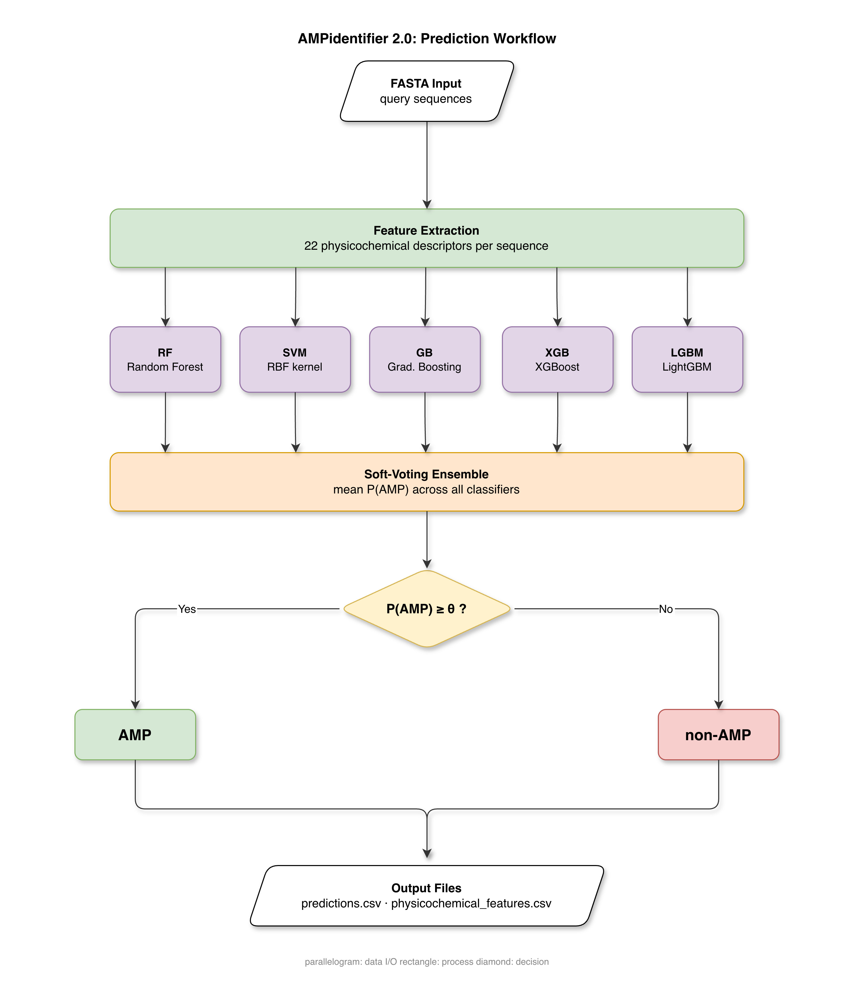

Users select a prediction configuration via the `--model` flag (`rf`, `svm`, `gb`, `xgb`, `lgbm`, or `voting`; default: `voting`). A custom probability threshold can be provided via `--threshold`; if omitted, the MCC-optimized threshold for the selected model is applied automatically. This design allows users to adjust the sensitivity-specificity trade-off without re-running inference. All three deployment modes below operate on the same pre-trained model artifacts and normalization parameters, producing identical predictions for any given input.

### Command-line interface

The CLI is the primary deployment mode for users working in Unix-based environments. After registering the `ampidentifier2` command (see Installation section of the repository README), predictions are executed as:

```
ampidentifier2 -i sequences.fasta -o results/ --model voting
```

Required arguments are `-i` (input FASTA path) and `-o` (output directory). The terminal output includes a per-run summary box reporting total sequences, AMP and non-AMP counts with percentages, the decision threshold applied, and the output file path. The CLI is compatible with macOS, Linux, and Windows Subsystem for Linux (WSL). A full list of arguments and defaults is available via `ampidentifier2 --help` (Figure 2).

**Figure 2.** AMPidentifier command-line interface (`ampidentifier2 --help`). The ASCII banner identifies the tool and version. The help output lists the required arguments (`-i`, `-o`), the `--model` flag with per-model performance benchmarks (Accuracy, AUC-ROC, MCC on the internal test set), and the optional `--threshold` flag for overriding the MCC-optimized default.

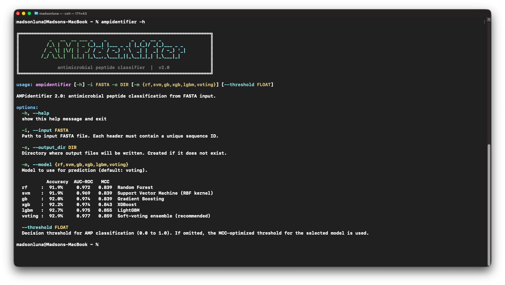

### Python package

AMPidentifier is installable as a Python package via the Python Package Index:

```
pip install ampidentifier
```

After installation, the same `ampidentifier2` entry point is available from the command line, and the `amp_identifier` package can be imported programmatically to call the prediction pipeline directly from Python scripts or Jupyter notebooks. The package requires Python >= 3.10 and is registered at https://pypi.org/project/ampidentifier.

### Web application

The AMPidentifier web application at https://www.lgbv-ufpe.net/AMPidentifier provides a browser-based interface that does not require local software installation. Users paste or upload sequences in FASTA format, select a model, and download the two output CSV files. The web server runs the same pre-trained models as the CLI and PyPI package, producing identical predictions for any given input. The interface is accessible from any device with a browser and an internet connection, including mobile devices, making it suitable for exploratory use and for users without programming experience (Figure 3).

**Figure 3.** AMPidentifier web application interface. (A) Input panel for FASTA sequence submission and model selection. (B) Sequence preview after upload. (C) Prediction results table displaying per-sequence AMP probability and color-coded AMP/non-AMP labels. (D) Detailed output view with interpretation guidance and download links for the prediction and feature CSV files.


## Implementation

### Dataset and data partitioning

The training dataset contains 13,246 sequences: 6,623 experimentally confirmed AMPs and 6,623 non-AMP peptide sequences. AMP sequences were drawn from APD3,[17] CAMP,[18] and LAMP;[19] non-AMP sequences were drawn from UniProt[20] entries annotated as lacking antimicrobial activity. To limit homology-derived redundancy, sequences sharing more than 80% pairwise identity were clustered with CD-HIT,[21] and one representative sequence per cluster was retained. The dataset is balanced (1:1 AMP:non-AMP). It was partitioned 80/20 by stratified random sampling into a training set of 10,596 sequences and a held-out test set of 2,650 sequences (1,325 per class). The test set was not used during hyperparameter optimization; it served exclusively for threshold calibration and final performance evaluation. Exploratory data analysis (EDA) of the assembled dataset is provided in Supplementary Section S1, including sequence length distribution, amino acid composition, global descriptor profiles, grouped amino acid composition, and positional feature distributions.

### Feature extraction

Each amino acid sequence $S$ is projected to a 22-dimensional feature vector $\mathbf{x} \in \mathbb{R}^{22}$ spanning four complementary descriptor groups, selected a priori based on established literature (references [6], [12], [14], [15], [16]). Seven global physicochemical descriptors are computed via the modlamp library[14] GlobalDescriptor and PeptideDescriptor classes: net charge at pH 7.0, isoelectric point (pI), instability index, aliphatic index, Boman index, hydrophobic ratio, and hydrophobic moment (Eisenberg scale, $\alpha$-helix angle 100°). Nine grouped amino acid composition (AAC) features capture the fraction of residues in each of nine functional groups: acidic (D, E), basic (K, R, H), polar (S, T, N, Q), nonpolar (A, V, L, I, M, F, Y, W, P), aliphatic (A, V, L, I, M), aromatic (F, Y, W), charged (D, E, K, R, H), small (A, G, S, D, T), and tiny (A, G, S), with group definitions following Jhong et al. (2019)[12] and Nagarajan et al. (2018).[6]

The remaining six features encode the relative position of the first residue of a given physicochemical class within the sequence, defined as $(i + 1) / L$ where $i$ is the zero-based index and $L$ is sequence length. Three features use the free energy of transition (FET) classification of Von Heijne and Blomberg (1979)[16]: low-FET residues (I, L, V, W, A, M, G, T; hydrophobic, membrane-preferring), intermediate-FET residues (F, Y, S, Q, C, N), and high-FET residues (P, H, K, E, D, R; hydrophilic, membrane-avoiding). Three further features use the solvent accessibility classification of Bhadra et al. (2018)[15]: buried (A, L, F, C, G, I, V, W), exposed (R, K, Q, E, N, D), and intermediate (M, S, P, T, H, Y). These positional features encode where in the sequence specific chemical environments first appear, information absent from global and compositional descriptors that has been shown to discriminate AMPs from non-AMPs.[15] The full descriptor list with groups and sources is in Supplementary Table S3.

Because descriptors span heterogeneous numeric scales, model-specific normalization is applied before inference. RF, GB, XGB, and LGBM use a RobustScaler fitted on the training partition, which centers on the median and scales by the interquartile range, reducing the influence of outlier sequences with extreme physicochemical values. SVM uses a StandardScaler (zero mean, unit variance), required for stable optimization of the margin-based objective. The voting ensemble model handles normalization internally within a scikit-learn VotingClassifier pipeline. All scaling parameters are estimated exclusively on the training partition and serialized as deployment artifacts alongside the model pickle files.

### Pre-trained classifiers

Five machine learning architectures were trained on the 10,596-sequence training partition. Hyperparameter optimization used RandomizedSearchCV (scikit-learn; n_iter = 100, 5-fold stratified cross-validation, AUC-ROC as the optimization metric). For each model, 100 configurations were sampled from the search space defined in Supplementary Table S2a; integer parameters were drawn from discrete uniform distributions, continuous parameters from uniform (U) or log-uniform (log-U) distributions over the stated ranges.

Random Forest (RF) constructs an ensemble of decision trees by bootstrap aggregation; at each split, a random subset of features (max_features = 0.30) decorrelates the trees and reduces variance. The best configuration used 229 estimators with no depth constraint, min_samples_leaf = 1, and min_samples_split = 3 (CV AUC-ROC = 0.9695). The Support Vector Machine (SVM) maximizes the margin between class hyperplanes in an RBF-projected feature space, with regularization parameter C and kernel width γ controlling the bias-variance trade-off; the best configuration was C = 2.80 and γ = 0.10 (CV AUC-ROC = 0.9671). Gradient Boosting (GB) is a sequential additive model that minimizes log-loss by fitting each successive tree to the pseudo-residuals of the current ensemble; the best configuration used 293 estimators, learning rate 0.062, max depth 6, and subsample 0.846 (CV AUC-ROC = 0.9723). XGBoost (XGB) extends GB with explicit L1 (α) and L2 (λ) regularization on leaf weights and second-order Taylor approximation for split finding; the best configuration used 448 estimators, learning rate 0.059, max depth 6, α = 0.013, λ = 0.313, subsample 0.678, and colsample_bytree 0.758 (CV AUC-ROC = 0.9741). LightGBM (LGBM) builds gradient-boosted trees using histogram-based split finding and leaf-wise (best-first) growth, which reduces training time on larger datasets relative to level-wise GB while allowing finer control of tree shape via the num_leaves parameter; the best configuration used 383 estimators, 47 leaves, max depth 7, learning rate 0.323, subsample 0.942, colsample_bytree 0.581, α = 0.001, and λ = 0.681 (CV AUC-ROC = 0.9740). Complete best-configuration values for all five models are in Supplementary Table S2b; CV AUC-ROC score distributions across all 100 search iterations are shown in Supplementary Figure S2.

After hyperparameter optimization, each model was retrained on the full training partition and serialized. MCC-optimized decision thresholds were determined on the held-out test set by sweeping predicted probabilities over 81 equally spaced values from 0.10 to 0.90 and selecting the value that maximizes MCC:

$$\text{MCC} = \frac{TP \cdot TN - FP \cdot FN}{\sqrt{(TP+FP)(TP+FN)(TN+FP)(TN+FN)}}$$

where TP, TN, FP, and FN are true positives, true negatives, false positives, and false negatives, respectively. MCC is sensitive to all four entries of the confusion matrix and provides a balanced criterion for binary classification on class-balanced datasets, avoiding the optimistic bias of accuracy and F1 toward the majority class. The `--threshold` flag allows overriding the MCC-optimized default at inference time for applications requiring a different sensitivity-specificity trade-off.

### Soft-voting ensemble

The voting ensemble averages the five predicted AMP probabilities:

$$P_{\text{voting}}(\text{AMP}) = \frac{1}{5} \sum_{k=1}^{5} P_k(\text{AMP})$$

where $k$ indexes RF, SVM, GB, XGB, and LGBM. A scikit-learn VotingClassifier object with `voting='soft'` encapsulates all five classifiers and their respective scalers into a single pipeline. At inference time, the raw 22-feature matrix is passed directly to the ensemble, which dispatches scaling internally before calling each sub-classifier. The ensemble threshold (0.56) was optimized on the held-out test set by the same MCC criterion applied to individual models.

Averaging probabilities integrates each classifier's confidence rather than counting votes, which is more informative when component classifiers assign markedly different probability values to borderline sequences. Because the five models differ in inductive bias, from the variance-reducing bagging of RF to the margin-based geometry of SVM, the sequential residual fitting of GB and XGB, and the histogram-based leaf-wise growth of LGBM, their individual probability estimates are partly independent, and the average tends to be better calibrated than any single model.

## Results

### Internal test set performance

The 13,246-sequence dataset was split 80/20 by stratified random sampling before any model fitting: 10,596 sequences formed the training partition and 2,650 sequences (1,325 AMP, 1,325 non-AMP) were held out. The held-out partition was never exposed to training or hyperparameter optimization; it was used exclusively for MCC-optimized threshold calibration and the performance evaluation reported here. Because training and test sequences originate from the same database sources (APD3, CAMP, LAMP, UniProt) and curation pipeline, internal metrics are expected to be optimistic relative to performance on novel sequences from independent sources. Table 2 reports classification metrics for all six AMPidentifier configurations on this partition.

**Table 2.** Classification performance on the internal held-out test set ($n$ = 2,650; 1,325 AMP, 1,325 non-AMP). Decision thresholds were MCC-optimized on this partition after training; the test set was not used during model fitting or hyperparameter search. The voting ensemble achieves the highest accuracy (92.9%), MCC (0.859), and AUC-ROC (0.977). Acc: accuracy; Sn: sensitivity (recall); Sp: specificity.

| Model  | Threshold | Acc (%) | Precision (%) | Sn (%) | Sp (%) | F1 (%) | MCC   | AUC-ROC |
|--------|-----------|---------|---------------|--------|--------|--------|-------|---------|
| RF     | 0.56      | 91.9    | 93.8          | 89.7   | 94.1   | 91.7   | 0.839 | 0.972   |
| SVM    | 0.47      | 91.9    | 91.8          | 92.1   | 91.8   | 91.9   | 0.839 | 0.969   |
| GB     | 0.55      | 92.0    | 92.9          | 90.9   | 93.1   | 91.9   | 0.839 | 0.974   |
| XGB    | 0.48      | 92.2    | 92.0          | 92.4   | 91.9   | 92.2   | 0.843 | 0.974   |
| LGBM   | 0.71      | 92.7    | 94.2          | 91.1   | 94.3   | 92.6   | 0.855 | 0.975   |
| Voting | 0.56      | 92.9    | 94.2          | 91.4   | 94.4   | 92.8   | 0.859 | 0.977   |

The voting ensemble achieves the highest values in accuracy (92.9%), precision (94.2%), specificity (94.4%), F1 (92.8%), MCC (0.859), and AUC-ROC (0.977); sensitivity is highest in XGB (92.4%). LGBM is the strongest individual classifier (MCC 0.855, AUC-ROC 0.975), followed by XGB (MCC 0.843). RF, SVM, and GB each reach MCC 0.839.

Hyperparameter tuning improved AUC-ROC and MCC for all five models relative to their default configurations. The largest gains were observed in GB (MCC +0.028, AUC-ROC +0.012), SVM (MCC +0.025, AUC-ROC +0.008), and LGBM (MCC +0.021). RF and XGB changed marginally, indicating their default hyperparameters were already near-optimal for this feature set and dataset size. Additional evaluation figures for the internal test set are provided in Supplementary Section S4: ROC curves (Figure S4a), calibration curves (Figure S4b), feature importance for tree-based models (Figure S4c), confusion matrices (Figure S4d), per-model metric comparisons (Figure S4e), precision-recall curves (Figure S4f), detection error tradeoff curves (Figure S4g), and threshold sensitivity analysis (Figure S4h).

### Comparison with published predictors

Unlike the internal test set, which shares database sources and curation methodology with the training data, the independent benchmark was assembled from a separate curation pipeline by Bhangu et al. (2025)[22] and contains 4,736 sequences (2,368 AMP, 2,368 non-AMP) covering antibacterial and antifungal activities. No sequence from this benchmark was used in any stage of AMPidentifier model training, threshold calibration, or feature selection, making it the primary estimate of generalization performance across all evaluated tools. The same benchmark was submitted to all accessible external predictors, enabling direct head-to-head comparison on identical input. Table 3 consolidates performance for all 15 evaluated classifier configurations; nine tools surveyed were inaccessible at evaluation time and are listed in Table 4.

**Table 3.** All evaluated classifiers on the independent benchmark ($n$ = 4,736 unless noted), grouped by tool. AMPidentifier rows use values from this study; external tool rows were evaluated by the authors of this work using the same benchmark dataset and evaluation protocol. Type: CLI = locally executable; Web = browser-based manual submission; pip = Python package (PyPI). AMPidentifier runs all three modes on the same serialized model artifacts. AUC-ROC is N/A for tools with binary-only output.

| Tool | Type | Acc (%) | Precision (%) | Sn (%) | Sp (%) | F1 (%) | MCC | AUC-ROC |
|------|------|---------|---------------|--------|--------|--------|-----|---------|
| AMPidentifier, Voting | CLI, Web, pip | 86.6 | 81.4 | 94.9 | 78.4 | 87.6 | 0.742 | 0.950 |
| AMPidentifier, LGBM | CLI, Web, pip | 87.0 | 82.2 | 94.5 | 79.6 | 87.9 | 0.749 | 0.948 |
| AMPidentifier, RF | CLI, Web, pip | 86.4 | 81.5 | 94.1 | 78.7 | 87.4 | 0.736 | 0.948 |
| AMPidentifier, GB | CLI, Web, pip | 85.8 | 80.5 | 94.5 | 77.0 | 86.9 | 0.727 | 0.935 |
| AMPidentifier, XGB | CLI, Web, pip | 84.6 | 78.7 | 94.8 | 74.4 | 86.0 | 0.707 | 0.930 |
| AMPidentifier, SVM | CLI, Web, pip | 84.1 | 78.5 | 93.9 | 74.2 | 85.5 | 0.695 | 0.943 |
| AMPScanner v2 | CLI | 85.4 | 80.2 | 93.9 | 76.9 | 86.5 | 0.718 | 0.936 |
| CAMPR3, RF | Web | 84.8 | 80.3 | 92.2 | 77.4 | 85.8 | 0.704 | 0.934 |
| CAMPR3, SVM | Web | 84.5 | 81.4 | 89.5 | 79.5 | 85.3 | 0.694 | 0.919 |
| CAMPR3, DA (Discriminant Analysis) | Web | 82.4 | 79.7 | 87.0 | 77.9 | 83.2 | 0.651 | 0.909 |
| CAMPR3, ANN | Web | 79.2 | 77.1 | 83.2 | 75.3 | 80.0 | 0.586 | N/A |
| AMPlify | CLI | 83.7 | 77.8 | 94.3 | 73.0 | 85.3 | 0.689 | 0.932 |
| ampir | CLI | 81.0 | 74.4 | 94.5 | 67.5 | 83.3 | 0.644 | 0.921 |
| DBAASP | Web | 75.6 | 81.7 | 64.1 | 86.5 | 71.8 | 0.521 | N/A |
| amPEPpy | CLI | 72.9 | 65.6 | 96.5 | 49.3 | 78.1 | 0.520 | 0.934 |

**Table 4.** Web-based AMP prediction tools identified in the literature and surveyed for inclusion in the benchmark but found inaccessible at evaluation time (March 2026). Reasons include DNS resolution failure, connection timeout, and permanent service discontinuation. None of these tools could be evaluated on the independent benchmark.

| Tool | Year | Reason for exclusion |
|------|------|----------------------|
| iAMP-2L | 2013 | Web server unreachable; DNS resolution failure |
| Deep-AmPEP30 | 2020 | Web server unreachable at time of evaluation |
| AI4AMP | 2021 | No open-source release; permanently inaccessible |
| iAMPpred | 2017 | DNS failure; server unreachable |
| PEPred-Suite | 2019 | Connection timeout; server unreachable |
| CS-AMPPred | 2012 | Server unreachable; scope limited to cysteine-stabilised AMPs |
| MLAMP | 2016 | Shared infrastructure with iAMP-2L; server offline |
| iAMPCN | 2023 | Source code not distributed; web server offline |
| AMAP | 2019 | Web server unavailable at time of evaluation |

Among AMPidentifier configurations, LGBM achieves the highest individual MCC (0.749) and accuracy (87.0%); the voting ensemble produces the highest sensitivity (94.9%) and AUC-ROC (0.950). Five of the six AMPidentifier configurations exceed AMPScanner v2 (MCC 0.718); only SVM (MCC 0.695) falls below.

The amPEPpy case illustrates the risk of evaluating AMP predictors by AUC-ROC or sensitivity alone. amPEPpy achieves AUC-ROC = 0.934 and sensitivity 96.5%, but specificity falls to 49.3% at its default threshold: approximately half of all true non-AMP sequences are predicted as AMPs. AMPidentifier configurations maintain specificity between 74.2% and 79.6% across all six models, limiting false-positive accumulation while preserving high sensitivity.

## Discussion

The performance gap between internal test results (ensemble MCC 0.859, AUC-ROC 0.977) and independent benchmark results (ensemble MCC 0.742, AUC-ROC 0.950) reflects domain shift between the training data sources (APD3, CAMP, LAMP, UniProt) and the independent benchmark. This magnitude of gap is typical for AMP predictors: tools trained and evaluated within the same database family consistently achieve higher MCC than when evaluated against independently curated sequences. Users should weight the independent benchmark numbers more heavily when assessing expected real-world performance.

The 22-descriptor feature set integrates three complementary information types that no single descriptor class provides alone. Global descriptors capture bulk physicochemical properties (charge, hydrophobicity, pI) that distinguish the average AMP from the average non-AMP; grouped amino acid composition resolves functional biochemical character at residue level; and the FET and solvent accessibility positional terms encode where specific chemical environments first appear along the chain. Feature importance analysis (Supplementary Figure S4c) places charge, Boman index, and hydrophobic moment consistently in the top-ranked positions across all tree-based classifiers, consistent with the known role of cationic amphipathicity in membrane disruption.[1,2] The positional FET and SA terms, though lower-ranked than global descriptors on average, contribute non-redundant positional information that global scalars cannot provide.

The inclusion of LightGBM as a fifth classifier is motivated by two properties. Its leaf-wise growth strategy, combined with histogram-based split finding, trained faster than XGB or GB on the 10,596-sequence training partition without sacrificing CV AUC-ROC (LGBM: 0.9740 vs. XGB: 0.9741 vs. GB: 0.9723). On the independent benchmark, LGBM achieves the highest individual MCC (0.749), outperforming RF (0.736), GB (0.727), XGB (0.707), and SVM (0.695). Its inclusion in the voting ensemble broadens the ensemble's decision basis and contributes the highest-performing individual classifier by benchmark MCC.

The physicochemical descriptor export remains a practical differentiator from comparable tools. Each run produces a per-sequence table of all 22 descriptors, which users can apply for downstream candidate ranking by biophysical criteria (e.g., filtering by Boman index above a threshold or requiring net charge within a specified range) without invoking a separate characterization tool.

The three deployment modes (CLI, PyPI, web server) operate on identical serialized model artifacts. This architecture limits the reproducibility risk associated with web-server-only distribution, given the high offline rate documented for published AMP prediction servers (Table 4). Distributing pre-trained model artifacts within the repository and supporting `pip install ampidentifier` keeps the tool available independently of server infrastructure. The registration of AMPidentifier with INPI (Registration No. BR-51-2025-005859-4) provides an additional layer of version provenance.

The specificity values observed on the independent benchmark (74.2% to 79.6%) indicate that a fraction of sequences annotated as non-AMP receive AMP predictions. Two factors contribute to this pattern beyond classifier error. First, the 22-descriptor feature vector summarizes physicochemical properties over the full sequence length; a protein whose primary function is unrelated to antimicrobial activity may nonetheless carry a segment with the cationic charge density and hydrophobic moment characteristic of membrane-active peptides, and the global descriptors will reflect that segment's contribution. Second, non-AMP annotations in curated databases record primary biological function, not exhaustive assay-based exclusion of antimicrobial activity. A well-documented example of this ambiguity is the class of encrypted antimicrobial peptides: short sequences embedded within larger precursor proteins, such as lactoferrin, casein, and hemoglobin, that are latent in the full-length form but release antimicrobial activity upon proteolytic cleavage. When full-length precursor sequences are presented to the classifier, the physicochemical signature of the embedded cryptic fragment can shift global descriptors toward the AMP region of feature space, producing a prediction that, while inconsistent with the protein's primary annotation, is not without biological basis. Sequences predicted as AMP at high probability despite a non-AMP annotation should therefore be treated as candidates for regional experimental evaluation rather than as classifier errors.

The principal limitation of AMPidentifier, shared with sequence-based AMP classifiers trained on database sequences, is that training data over-represents well-characterized AMP families from specific organisms and activity classes. Performance on AMPs with non-canonical structures, atypical amino acid compositions, or activities outside the training distribution may differ from the benchmark estimates reported here. For such sequences, AMP probability values should be treated as a screening score, and experimental validation remains the definitive confirmation step.

## Summary and conclusions

AMPidentifier provides sequence-based AMP prediction through five independently accessible machine learning classifiers and a soft-voting ensemble. The training dataset contains 13,246 balanced sequences; features are a 22-descriptor set covering global peptide properties, functional group fractions, and positional FET and solvent accessibility distributions; LightGBM is included as a fifth classifier. On an internal test set of 2,650 sequences, the voting ensemble achieves accuracy 92.9%, MCC 0.859, and AUC-ROC 0.977. On an independent benchmark of 4,736 sequences, the ensemble achieves MCC 0.742 and AUC-ROC 0.950, exceeding AMPScanner v2 (MCC 0.718) and all other accessible comparators. Nine of nine web-only tools surveyed were inaccessible at evaluation time; AMPidentifier is distributed through three deployment modes operating on identical model artifacts to ensure long-term availability. Per-sequence physicochemical descriptor tables are produced alongside binary predictions in all deployment modes. AMPidentifier is available as a command-line tool (`ampidentifier2`), a PyPI package (`pip install ampidentifier`, Python >= 3.10), and a web application at https://www.lgbv-ufpe.net/AMPidentifier.

## Associated content

### Data availability statement

AMPidentifier is freely available under an open-source license at https://github.com/madsondeluna/AMPIdentifier. The independent benchmark dataset, evaluation scripts, and all figures are available at https://github.com/madsondeluna/AMPidentifierBenchmark. AMPidentifier is registered with the INPI, Registration No. BR-51-2025-005859-4.

### Supporting information

### S1: Exploratory data analysis of the training dataset

**Figure S1a.** Sequence length distribution for AMP and non-AMP classes in the training dataset ($n$ = 13,246; 6,623 per class). AMP sequences are shorter on average, with most in the 10–50 residue range; non-AMP sequences show a broader length distribution extending beyond 100 residues.

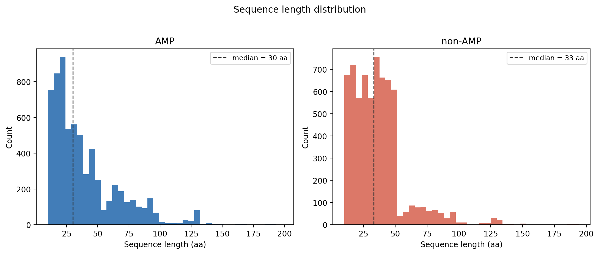

**Figure S1b.** Per-residue amino acid composition (molar fraction) for AMP and non-AMP classes. AMP sequences are enriched in cationic residues (Lys, Arg) and depleted in acidic residues (Asp, Glu), consistent with the net positive charge characteristic of membrane-active peptides.

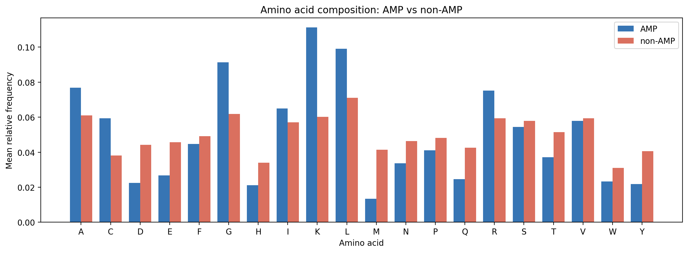

**Figure S1c.** Distributions of the seven global physicochemical descriptors (charge, pI, instability index, aliphatic index, Boman index, hydrophobic ratio, hydrophobic moment) for AMP and non-AMP classes. AMPs show higher net charge, Boman index, and hydrophobic moment compared to non-AMPs, reflecting the cationic amphipathic profile associated with membrane disruption activity.

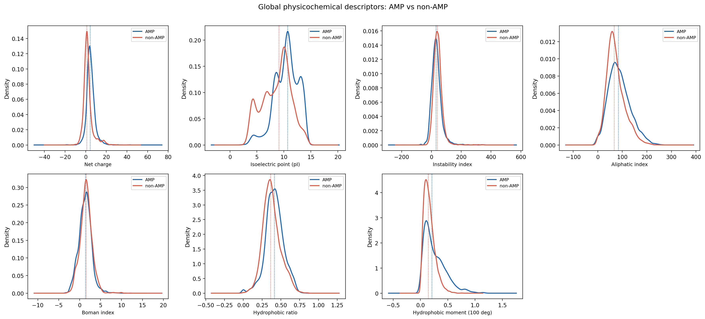

**Figure S1d.** Grouped amino acid composition fractions for the nine functional groups (acidic, basic, polar, nonpolar, aliphatic, aromatic, charged, small, tiny) across AMP and non-AMP classes. AMPs are enriched in basic (Lys, Arg, His) and charged residues and depleted in acidic (Asp, Glu) residues relative to non-AMPs.

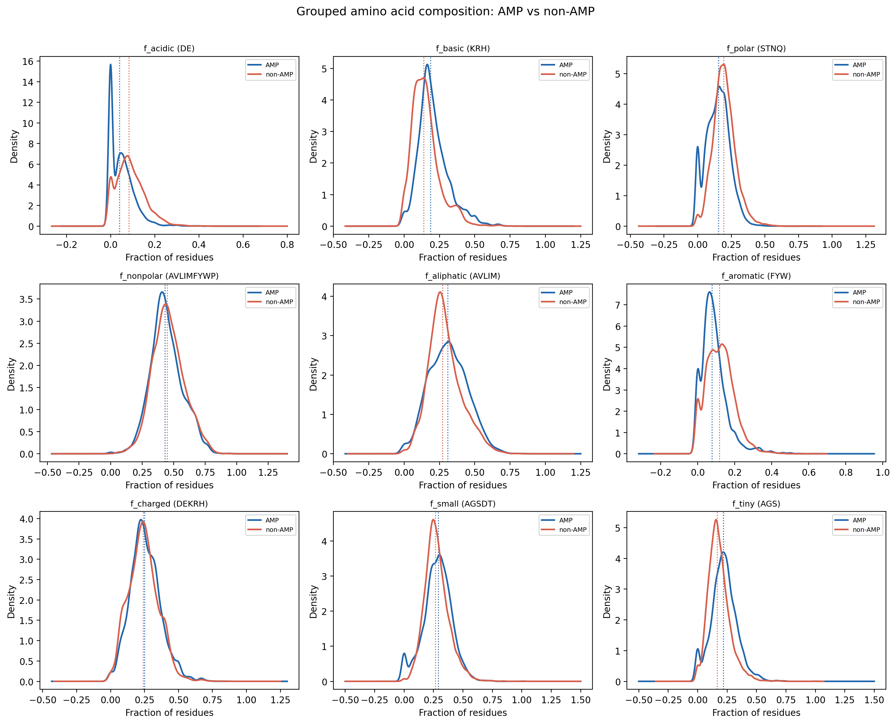

**Figure S1e.** Positional feature distributions (D1 values) for the three FET groups and three solvent accessibility groups, for AMP and non-AMP classes. D1 is the relative position of the first residue belonging to each group, normalized by sequence length. Differences between classes indicate that AMP and non-AMP sequences differ systematically in where specific chemical environments first appear along the chain.

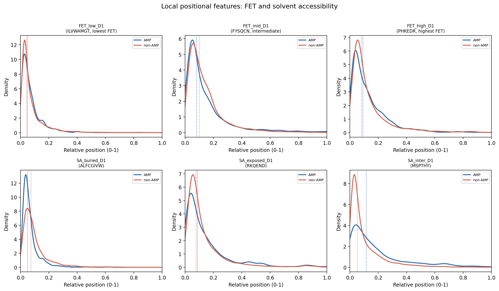

### S2: Hyperparameter search spaces and best configurations

**Table S2a.** Hyperparameter search spaces used in RandomizedSearchCV. Integer ranges are half-open [a, b); continuous ranges use uniform (U) or log-uniform (log-U) distributions. A dash (—) indicates the parameter does not apply to that model.

| Hyperparameter | RF | SVM | GB | XGB | LGBM |
|---|---|---|---|---|---|
| n_estimators | [100, 600) | — | [100, 500) | [100, 500) | [100, 600) |
| max_depth | {None,10,20,30,40} | — | [2, 8) | [2, 8) | [3, 10) |
| learning_rate | — | — | log-U[0.001, 0.5] | log-U[0.001, 0.5] | log-U[0.001, 0.5] |
| subsample | — | — | U[0.5, 1.0) | U[0.5, 1.0) | U[0.5, 1.0) |
| colsample_bytree | — | — | — | U[0.5, 1.0) | U[0.5, 1.0) |
| min_samples_split | [2, 15) | — | [2, 15) | — | — |
| min_samples_leaf | [1, 8) | — | [1, 8) | — | — |
| max_features | {sqrt, log2, 0.3, 0.5} | — | — | — | — |
| num_leaves | — | — | — | — | [20, 150) |
| min_child_weight | — | — | — | [1, 10) | — |
| min_child_samples | — | — | — | — | [5, 50) |
| α (reg_alpha) | — | — | — | log-U[10⁻⁴, 10] | log-U[10⁻⁴, 10] |
| λ (reg_lambda) | — | — | — | log-U[0.1, 10] | log-U[0.1, 10] |
| kernel | — | RBF (fixed) | — | — | — |
| C | — | log-U[0.01, 100] | — | — | — |
| γ | — | {scale, 10⁻⁴, 10⁻³, 10⁻², 0.1, 1.0} | — | — | — |

**Table S2b.** Best configurations identified by RandomizedSearchCV (n_iter = 100, 5-fold stratified CV, AUC-ROC metric) for all five classifiers. CV AUC-ROC is reported as mean ± standard deviation across folds.

| Parameter | RF | SVM | GB | XGB | LGBM |
|---|---|---|---|---|---|
| n_estimators | 229 | — | 293 | 448 | 383 |
| max_depth | None | — | 6 | 6 | 7 |
| learning_rate | — | — | 0.062 | 0.059 | 0.323 |
| subsample | — | — | 0.846 | 0.678 | 0.942 |
| colsample_bytree | — | — | — | 0.758 | 0.581 |
| min_samples_split | 3 | — | 3 | — | — |
| min_samples_leaf | 1 | — | 2 | — | — |
| max_features | 0.30 | — | — | — | — |
| num_leaves | — | — | — | — | 47 |
| min_child_weight | — | — | — | 6 | — |
| min_child_samples | — | — | — | — | 10 |
| α (reg_alpha) | — | — | — | 0.0125 | 0.0012 |
| λ (reg_lambda) | — | — | — | 0.313 | 0.681 |
| kernel | — | RBF | — | — | — |
| C | — | 2.796 | — | — | — |
| γ | — | 0.10 | — | — | — |
| **CV AUC-ROC** | **0.9695 ± 0.0018** | **0.9671 ± 0.0030** | **0.9723 ± 0.0023** | **0.9741 ± 0.0020** | **0.9740 ± 0.0016** |

**Figure S2.** Cross-validation AUC-ROC score distributions across 100 RandomizedSearchCV iterations per model. LGBM and XGB reach the highest median CV AUC-ROC, followed by GB and RF. SVM shows a narrower distribution, reflecting fewer degrees of freedom in the search space.

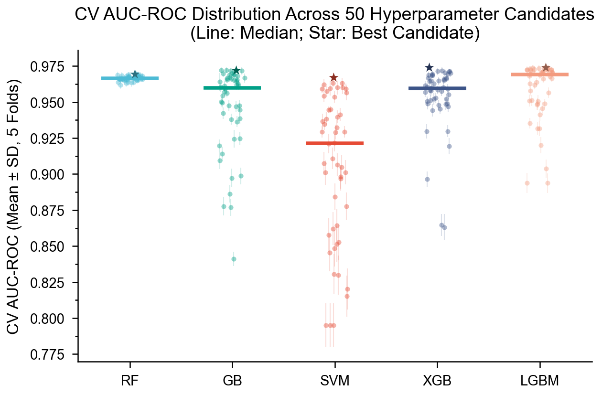

### S3: Feature selection and descriptor list

All 22 descriptors were retained after feature selection. The table below lists each descriptor, its group, and its source.

| # | Descriptor | Group | Source |
|---|---|---|---|
| 1 | Charge | Global | modlamp [14] |
| 2 | pI | Global | modlamp [14] |
| 3 | Instability index | Global | modlamp [14] |
| 4 | Aliphatic index | Global | modlamp [14] |
| 5 | Boman index | Global | modlamp [14] |
| 6 | Hydrophobic ratio | Global | modlamp [14] |
| 7 | Hydrophobic moment | Global | modlamp [14] |
| 8 | f_acidic | AAC group | Jhong et al. [12], Nagarajan et al. [6] |
| 9 | f_basic | AAC group | Jhong et al. [12], Nagarajan et al. [6] |
| 10 | f_polar | AAC group | Jhong et al. [12], Nagarajan et al. [6] |
| 11 | f_nonpolar | AAC group | Jhong et al. [12], Nagarajan et al. [6] |
| 12 | f_aliphatic | AAC group | Jhong et al. [12], Nagarajan et al. [6] |
| 13 | f_aromatic | AAC group | Jhong et al. [12], Nagarajan et al. [6] |
| 14 | f_charged | AAC group | Jhong et al. [12], Nagarajan et al. [6] |
| 15 | f_small | AAC group | Jhong et al. [12], Nagarajan et al. [6] |
| 16 | f_tiny | AAC group | Jhong et al. [12], Nagarajan et al. [6] |
| 17 | FET_low_D1 | FET positional | Von Heijne & Blomberg [16] |
| 18 | FET_mid_D1 | FET positional | Von Heijne & Blomberg [16] |
| 19 | FET_high_D1 | FET positional | Von Heijne & Blomberg [16] |
| 20 | SA_buried_D1 | SA positional | Bhadra et al. [15] |
| 21 | SA_exposed_D1 | SA positional | Bhadra et al. [15] |
| 22 | SA_inter_D1 | SA positional | Bhadra et al. [15] |

### S4: Figures from the internal held-out test set

**Figure S4a.** ROC curves for all six AMPidentifier configurations on the internal held-out test set ($n$ = 2,650; 1,325 AMP, 1,325 non-AMP). AUC-ROC ranges from 0.969 (SVM) to 0.977 (Voting ensemble). LGBM and XGB are the strongest individual classifiers (AUC-ROC 0.975 and 0.974, respectively).

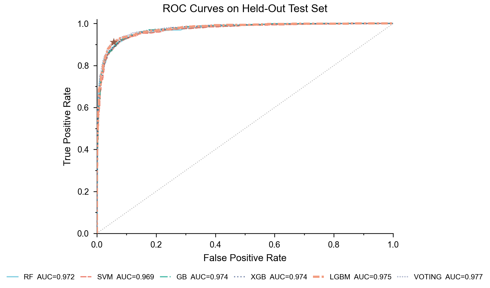

**Figure S4b.** Calibration curves (reliability diagrams) for all six AMPidentifier configurations on the internal held-out test set. A perfectly calibrated model follows the diagonal. RF and GB are well-calibrated across the probability range; SVM shows slight overconfidence at high predicted probabilities; LGBM and XGB are marginally underconfident in the 0.6–0.8 range.

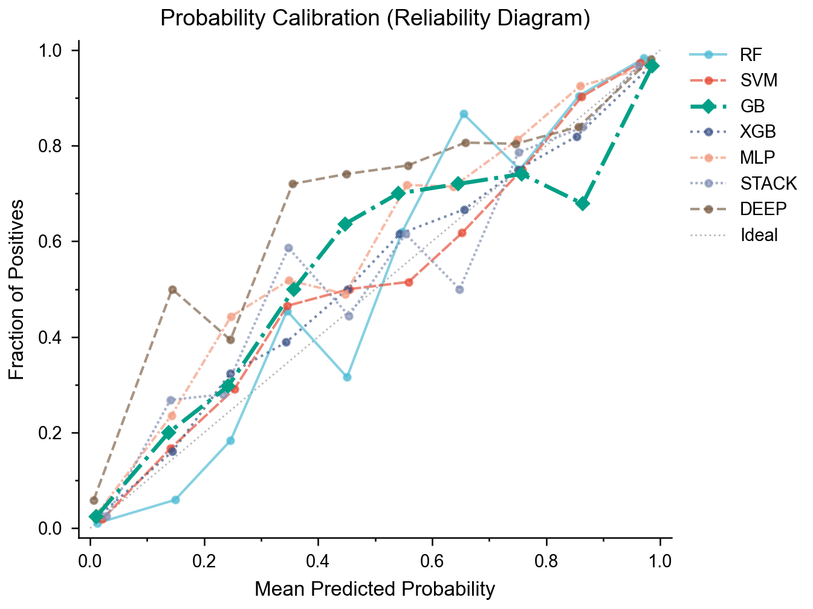

**Figure S4c.** Feature importance ranking (top 20 of 22 descriptors by mean decrease in impurity) for RF, GB, XGB, and LGBM. SVM with RBF kernel does not provide a native feature importance metric and is excluded.

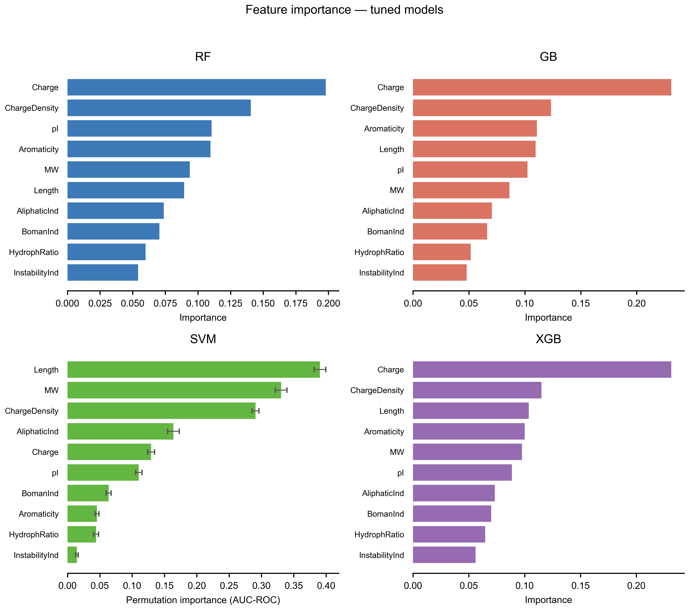

**Figure S4d.** Confusion matrices for all six AMPidentifier configurations on the internal held-out test set ($n$ = 2,650). All models correctly classify over 91% of sequences. LGBM achieves the fewest false negatives; RF achieves the fewest false positives.

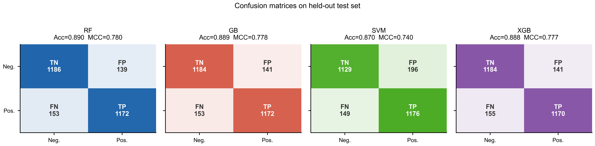

**Figure S4e.** Per-model comparison of all evaluation metrics on the internal held-out test set. LGBM leads in MCC (0.855), precision (94.2%), and specificity (94.3%). The voting ensemble leads in F1 (92.8%) and AUC-ROC (0.977).

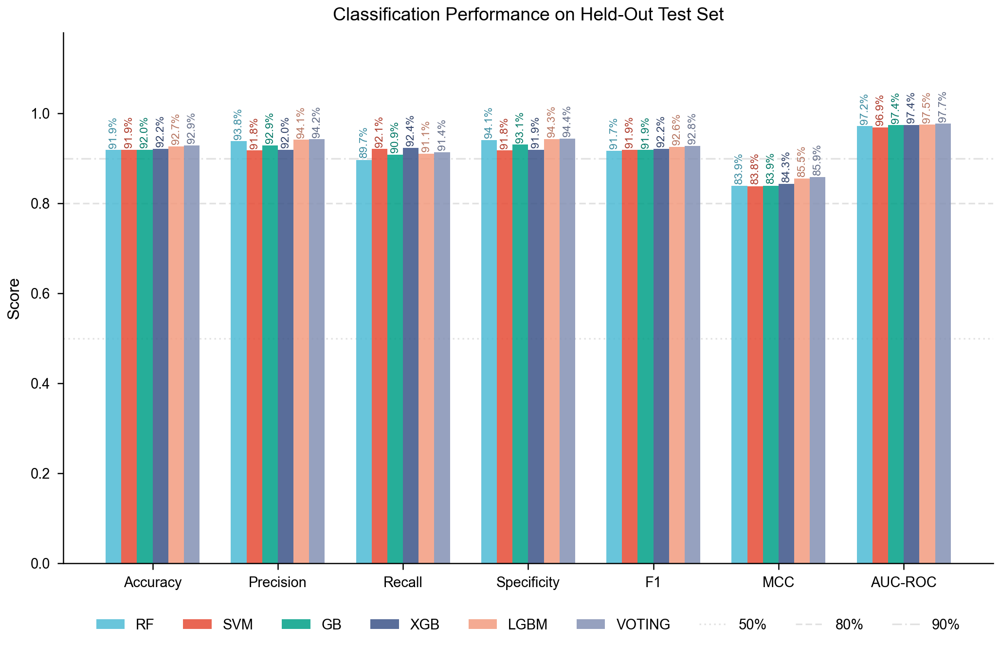

**Figure S4f.** Precision-recall curves for all six AMPidentifier configurations on the internal held-out test set. All models maintain precision above 0.87 at recall 0.90.

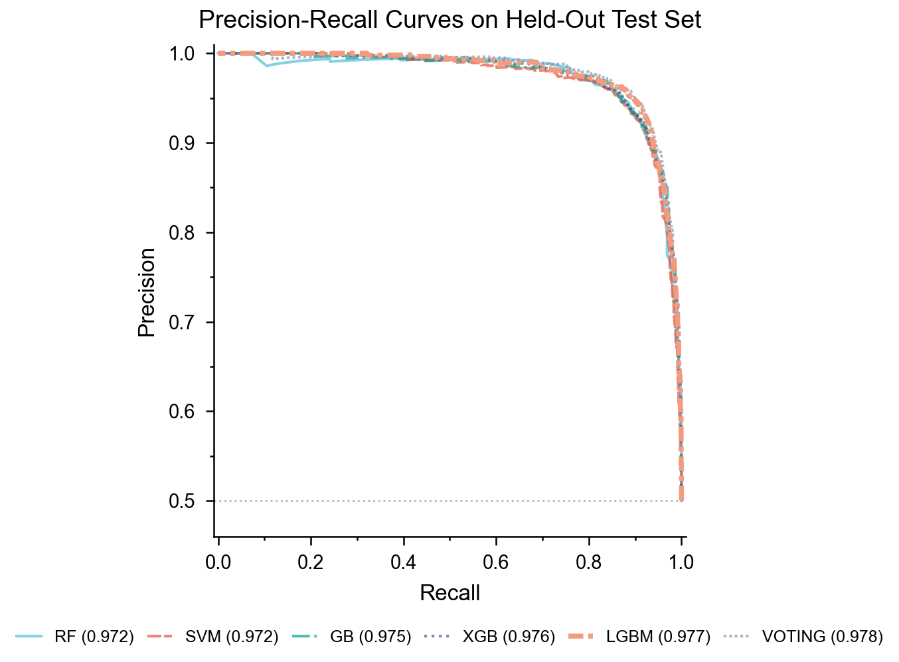

**Figure S4g.** Detection error tradeoff (DET) curves for all six AMPidentifier configurations on the internal held-out test set. LGBM achieves the lowest combined false positive and false negative rates.

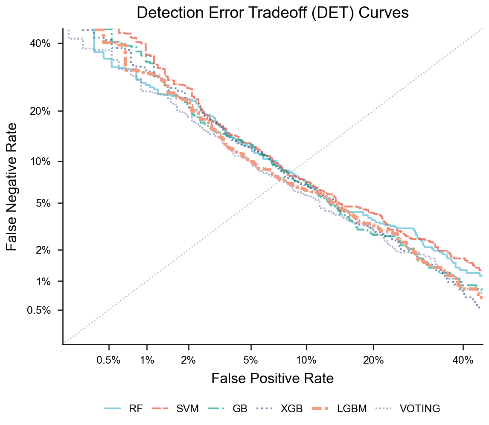

**Figure S4h.** Threshold sensitivity for all five base models: MCC, F1, Precision, and Recall as a function of decision threshold. The vertical dashed line marks the MCC-optimized threshold for each model; the star marks the MCC value at that threshold. The voting ensemble applies the threshold shown in Table 2.

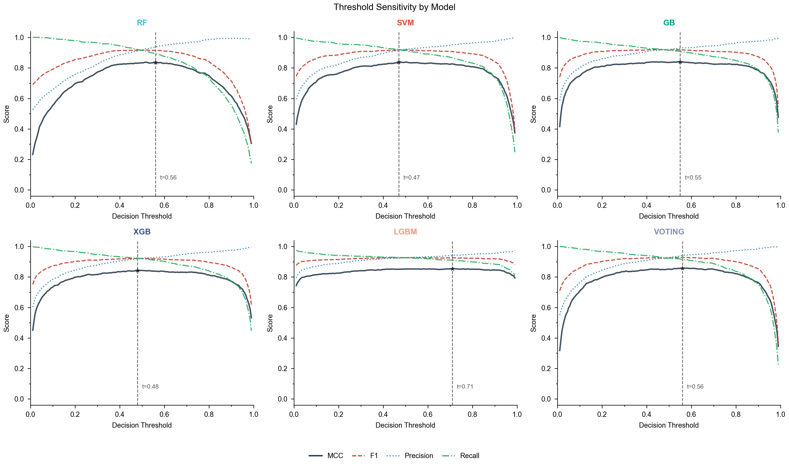

## Author contributions

M.A.L.A.: Conceptualization, Methodology, Software, Validation, Formal analysis, Data curation, Writing, original draft. R.L.S.: Software, Validation, Writing, review and editing. J.P.B.N.: Validation, Writing, review and editing. D.E.S.S.: Methodology, Writing, review and editing. C.A.S.S.: Supervision, Writing, review and editing. A.M.B.I.: Conceptualization, Resources, Supervision, Project administration, Funding acquisition, Writing, review and editing. All authors approved the final manuscript.

## Funding sources

This work was supported by the Coordenação de Aperfeiçoamento de Pessoal de Nível Superior (CAPES), Conselho Nacional de Desenvolvimento Científico e Tecnológico (CNPq), Fundação de Amparo à Pesquisa do Estado de Minas Gerais (FAPEMIG), and Fundação de Amparo à Pesquisa do Estado de Pernambuco (FACEPE).

## Notes

The authors declare no conflict of interest.

## Acknowledgments

The authors thank FAPEMIG for M.A.L.A.'s PhD scholarship. The authors acknowledge the National Laboratory for Scientific Computing (LNCC/MCTI, Brazil) for providing HPC resources of the SDumont supercomputer.

## Abbreviations

Acc, Accuracy; AMP, Antimicrobial Peptide; AUC-ROC, Area Under the Receiver Operating Characteristic Curve; CLI, Command-Line Interface; CV, Cross-Validation; FET, Free Energy of Transition; F1, F1-score; FN, False Negatives; FP, False Positives; GB, Gradient Boosting; LGBM, LightGBM; MCC, Matthews Correlation Coefficient; PyPI, Python Package Index; RBF, Radial Basis Function; RF, Random Forest; SA, Solvent Accessibility; Sn, Sensitivity; Sp, Specificity; SVM, Support Vector Machine; TN, True Negatives; TP, True Positives; XGB, XGBoost.

## References

(1) Hancock, R. E. W.; Sahl, H.-G. Antimicrobial and host-defense peptides as new anti-infective therapeutic strategies. *Nat. Biotechnol.* **2006**, *24*, 1551-1557.

(2) Zasloff, M. Antimicrobial peptides of multicellular organisms. *Nature* **2002**, *415*, 389-395.

(3) World Health Organization. *Global Antimicrobial Resistance and Use Surveillance System (GLASS) Report*; WHO: Geneva, 2022.

(4) Mishra, B.; Reiling, S.; Bhattacharya, D.; Bhattacharya, S. Host defense antimicrobial peptides as antibiotics: design and application strategies. *Curr. Opin. Chem. Biol.* **2017**, *38*, 87-96.

(5) Brogden, K. A. Antimicrobial peptides: pore formers or metabolic inhibitors in bacteria? *Nat. Rev. Microbiol.* **2005**, *3*, 238-250.

(6) Nagarajan, D.; Nagarajan, T.; Roy, N.; Kulkarni, O.; Ravichandran, S.; Mishra, M.; Bhattacharyya, S.; Chandra, N. Computational antimicrobial peptide design and evaluation against multidrug-resistant clinical isolates of bacteria. *J. Biol. Chem.* **2018**, *293*, 3492-3509.

(7) Waghu, F. H.; Barai, R. S.; Gurung, P.; Idicula-Thomas, S. CAMPR3: a database on sequences, structures and signatures of antimicrobial peptides. *Nucleic Acids Res.* **2016**, *44*, D1094-D1097.

(8) Veltri, D.; Kamath, U.; Shehu, A. Deep learning improves antimicrobial peptide recognition. *Bioinformatics* **2018**, *34*, 2740-2747.

(9) Li, C.; Sutherland, D.; Hammond, S. A.; Yang, C.; Taho, F.; Bergman, L.; Houston, S.; Warren, R. L.; Wong, T.; Hoang, L. M. N.; Cameron, C. E.; Helbing, C. C.; Birol, I. AMPlify: a multi-label AMP annotation tool with deep learning. *BMC Genomics* **2022**, *23*, 77.

(10) Lawrence, T. J.; Carper, D. L.; Spangler, M. K.; Batzer, M. A.; Willyard, A.; Glenn, T. C.; Matz, M. V.; Bhattacharya, D.; Bhattacharya, S. amPEPpy 1.0: a portable and accurate antimicrobial peptide prediction tool. *Bioinformatics* **2021**, *37*, 2058-2060.

(11) Fingerhut, L. C. H. W.; Miller, D. J.; Strugnell, J. M.; Daly, N. L.; Cooke, I. R. ampir: an R package for fast genome-wide prediction of antimicrobial peptides. *Bioinformatics* **2020**, *36*, 5262-5263.

(12) Jhong, J.-H.; Chi, Y.-H.; Li, W.-C.; Lin, T.-H.; Huang, K.-Y.; Lee, T.-Y. dbAMP: an integrated resource for exploring antimicrobial peptides with functional activities and physicochemical properties on transcriptomics analysis. *Nucleic Acids Res.* **2019**, *47*, D285-D297.

(13) Meher, P. K.; Sahu, T. K.; Saini, V.; Rao, A. R. Predicting antimicrobial peptides with improved accuracy by incorporating the compositional, physico-chemical and structural features into Chou's general PseAAC. *Sci. Rep.* **2017**, *7*, 42362.

(14) Müller, A. T.; Gabernet, G.; Hiss, J. A.; Schneider, G. modlAMP: Python for antimicrobial peptides. *Bioinformatics* **2017**, *33*, 2753-2755.

(15) Bhadra, P.; Yan, J.; Li, J.; Fong, S.; Siu, S. W. I. AmPEP: sequence-based prediction of antimicrobial peptides using distribution patterns of amino acid properties and random forest. *Sci. Rep.* **2018**, *8*, 1697.

(16) Von Heijne, G.; Blomberg, C. Trans-membrane translocation of proteins. *Eur. J. Biochem.* **1979**, *97*, 175-181.

(17) Wang, G.; Li, X.; Wang, Z. APD3: the antimicrobial peptide database as a tool for research and education. *Nucleic Acids Res.* **2016**, *44*, D1087-D1093.

(18) Waghu, F. H.; Gopi, L.; Barai, R. S.; Ramteke, P.; Nizami, B.; Idicula-Thomas, S. CAMP: Collection of sequences and structures of antimicrobial peptides. *Nucleic Acids Res.* **2014**, *42*, D1154-D1158.

(19) Zhao, X.; Wu, H.; Lu, H.; Li, G.; Huang, Q. LAMP: a database linking antimicrobial peptides. *PLoS ONE* **2013**, *8*, e66557.

(20) UniProt Consortium. UniProt: the universal protein knowledgebase in 2023. *Nucleic Acids Res.* **2023**, *51*, D523-D531.

(21) Fu, L.; Niu, B.; Zhu, Z.; Wu, S.; Li, W. CD-HIT: accelerated for clustering the next-generation sequencing data. *Bioinformatics* **2012**, *28*, 3150-3152.

(22) Bhangu, K. S. et al. Independent benchmark dataset for sequence-based antimicrobial peptide prediction tools. **2025**, in press.
